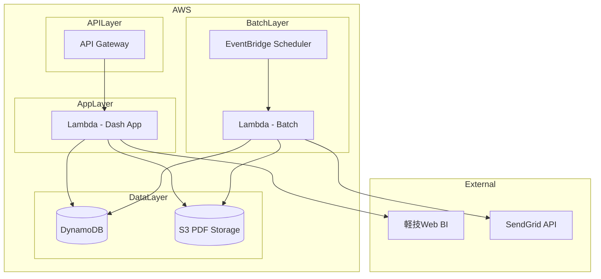
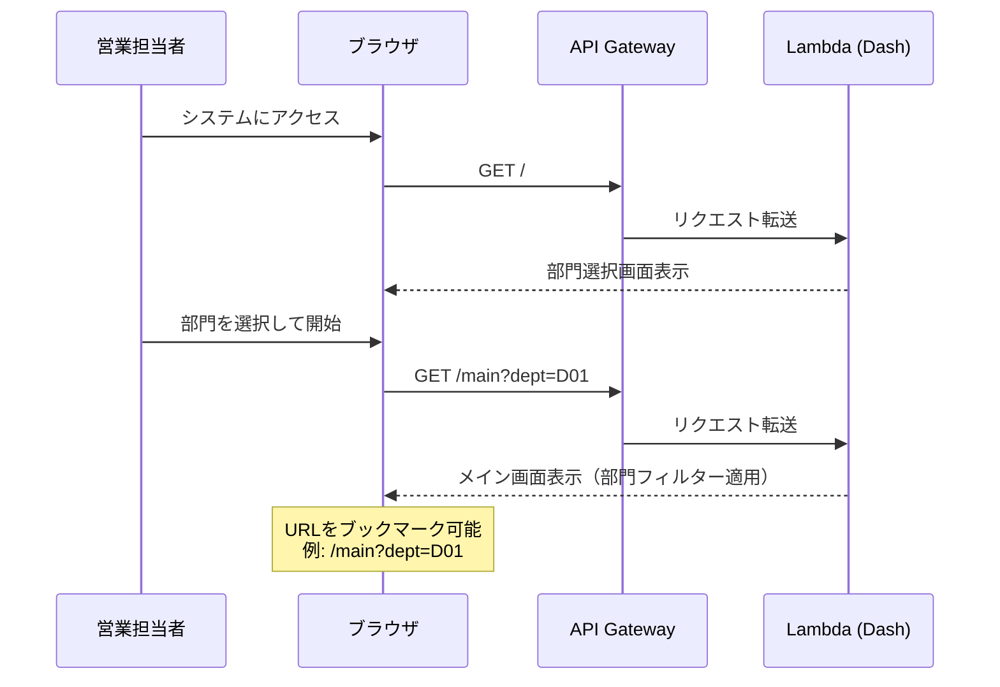
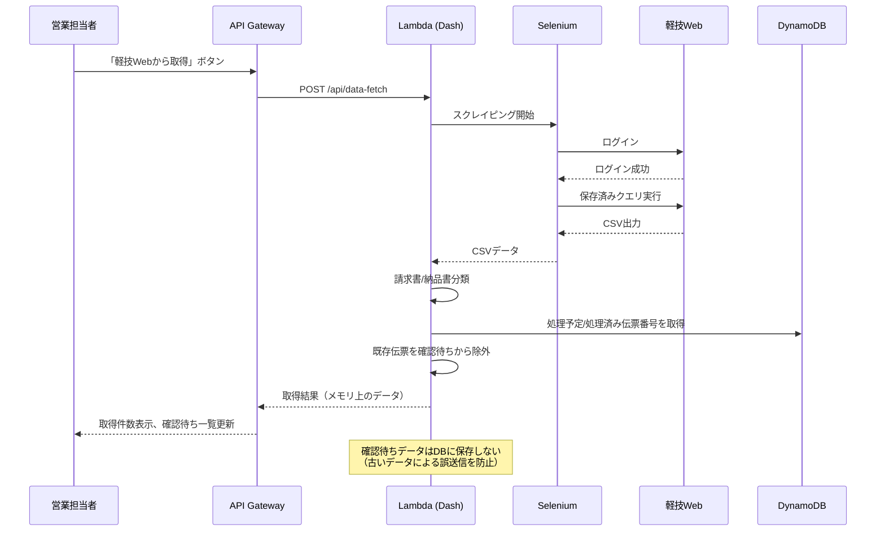
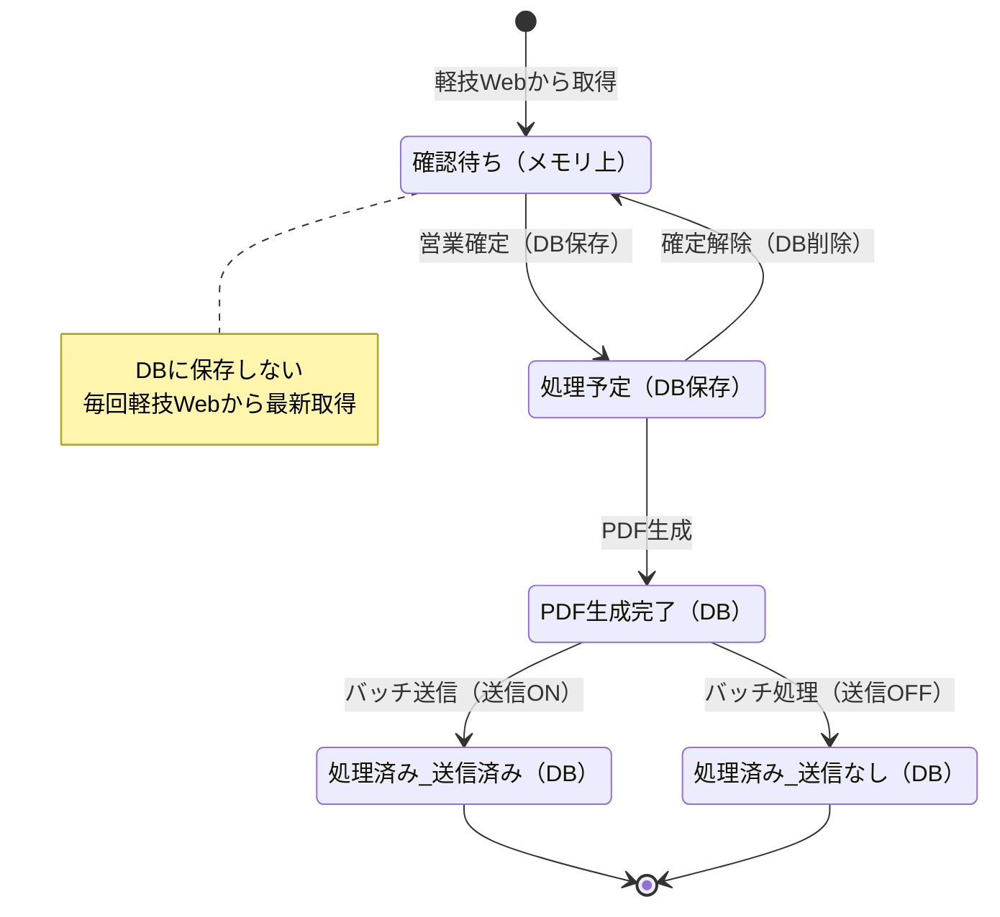
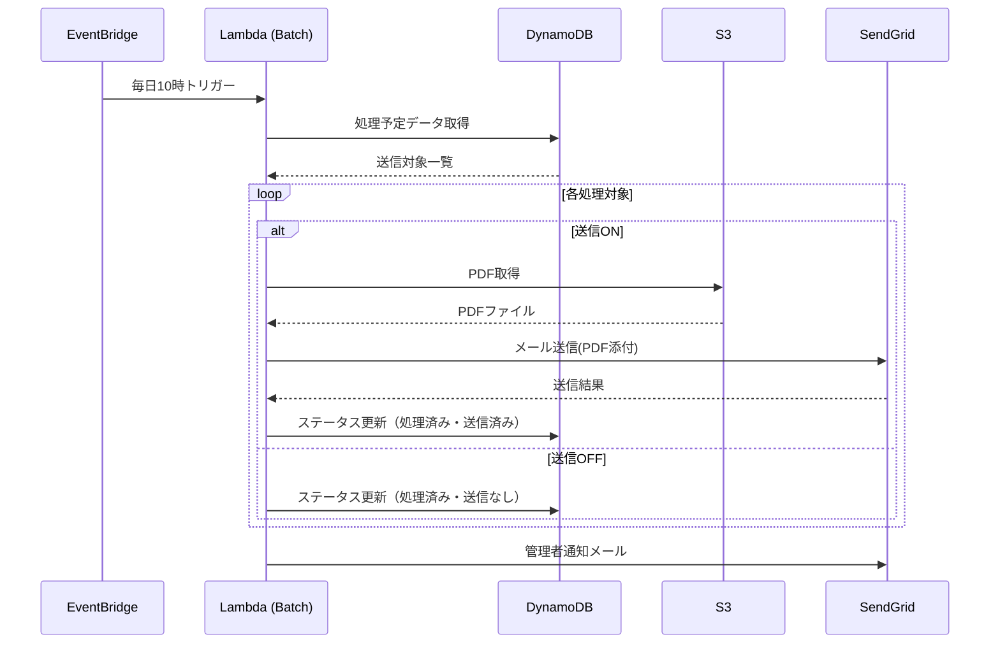
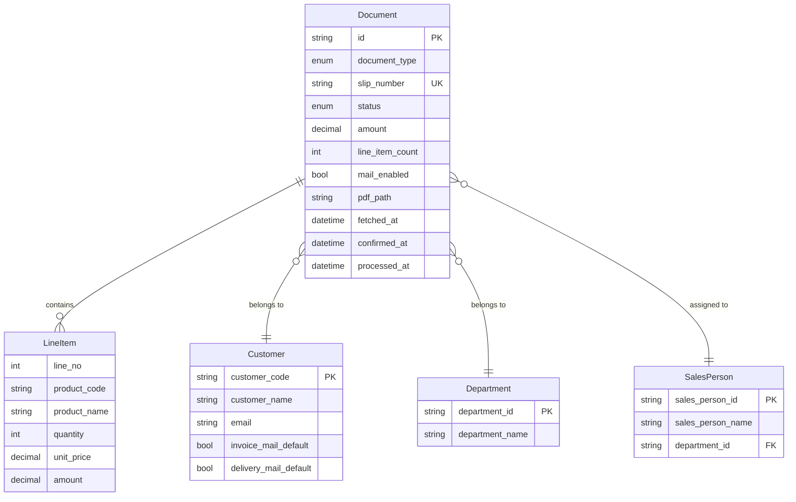

# Design Document

## Overview

**Purpose**: 本システムは、軽技Web（BIツール）から売上明細データを取得し、営業担当者による確認・確定を経て、請求書・納品書PDFを顧客にメール送信する業務効率化システムを提供する。

**Users**: 営業担当者が本システムを利用し、請求書・納品書の確認・送信業務を効率化する。

**Impact**: 現在の紙ベースの請求書・納品書発行業務をデジタル化し、手作業によるミスを削減、送信履歴の追跡を可能にする。

※当初は経理承認→営業確認の2段階承認フローを想定していたが、経理承認は不要となり、営業確認のみの1段階フローに変更された。

### Goals
- 軽技Webから売上明細データを効率的に取得し、最新データを画面表示する
- 営業担当者による確認・確定フローを実現する
- 確定時にデータをスナップショットとしてDBに保存する
- 確定済みデータから請求書・納品書PDFを自動生成する
- 毎日10時に処理予定の書類をメール送信する
- IP制限による低コストなアクセス制御を実現する
- 部門ごとのURLでブックマーク可能にする

### Non-Goals
- ログイン認証機能（IP制限のみで対応）
- ロールベースのアクセス制御
- 本システム内でのメール送信履歴管理（SendGrid管理画面で確認）
- 得意先マスタの本システム内での管理（軽技Webから取得）
- 営業担当者による明細データの編集（読み取り専用）
- 確認待ちデータのDB保存（常に軽技Webから最新取得）

### データ保存方針
- **確認待ち**: DBに保存しない。毎回軽技Webから最新データを取得（古いデータによる誤送信を防止）
- **処理予定/処理済み**: 確定時にDBに保存（確定時点のスナップショット）
- **送信ON/OFF設定**: ブラウザのlocalStorageに保存。データ再取得時もユーザー設定を保持。確定時に該当エントリを削除

## Architecture

### Architecture Pattern & Boundary Map



**Architecture Integration**:
- Selected pattern: サーバーレスアーキテクチャ — 完全従量課金でコスト最小化、運用負荷軽減
- Domain/feature boundaries: エッジ層（CloudFront/API Gateway）、アプリ層（Lambda + Dash）、データ層（DynamoDB/S3）、バッチ層（Lambda）を分離
- Existing patterns preserved: 該当なし（新規開発）
- New components rationale: 全コンポーネントがサーバーレスで、使用時のみ課金
- Steering compliance: AWS環境使用の方針に準拠、コスト最小化を実現

### Technology Stack

| Layer | Choice / Version | Role in Feature | Notes |
|-------|------------------|-----------------|-------|
| Frontend | Dash (Plotly) 2.x / Python 3.12 | 管理画面UI | Pythonのみで迅速な開発、Lambda対応、業務アプリに最適 |
| Backend | Dash + Flask (内蔵) | REST API、ビジネスロジック | DashはFlaskベース、追加フレームワーク不要 |
| ASGI Adapter | Mangum | Lambda対応 | ASGI/WSGIアプリをLambdaで実行 |
| Data / Storage | DynamoDB (オンデマンド) | 売上明細、承認状態の永続化 | サーバーレス、従量課金で低コスト |
| File Storage | AWS S3 | PDF保存 | Presigned URLでセキュアなアクセス |
| Email | SendGrid API v3 | メール送信 | 添付ファイル対応、送信履歴管理 |
| Scraping | Selenium 4.x (headless Chrome) | 軽技Webスクレイピング | Lambda Layer使用、または別Lambda |
| PDF Generation | WeasyPrint 60+ | 請求書・納品書PDF生成 | HTML/CSSテンプレートベース |
| Batch | AWS Lambda + EventBridge | 定時メール送信 | サーバーレス、cron式スケジュール |
| Infrastructure | AWS Lambda + API Gateway | 完全サーバーレス | IP制限はAPI Gatewayリソースポリシーで実現 |
| Deploy | AWS SAM | IaCデプロイ | template.yamlで構成管理 |

### コスト見積もり（月額）

| リソース | 想定利用量 | コスト |
|----------|-----------|--------|
| Lambda | 10,000リクエスト/月 | $0.20 |
| API Gateway | 10,000リクエスト/月 | $0.035 |
| DynamoDB | 1,000書き込み、10,000読み取り | $1未満 |
| S3 | 1GB保存、1,000リクエスト | $0.50 |
| **合計** | | **約$2/月** |

## System Flows

### 部門選択・画面遷移フロー



### データ取得フロー



### 確認・確定・送信フロー



### メールバッチ送信フロー



## Requirements Traceability

| Requirement | Summary | Components | Interfaces | Flows | Note |
|-------------|---------|------------|------------|-------|------|
| 1.1-1.7 | 部門選択 | DepartmentSelectPage, MainPage | - | 部門選択・画面遷移フロー | |
| 2.1-2.8 | データ取得 | DataFetchService, ScrapingService | DataFetchAPI | データ取得フロー | 確認待ちデータはDBに保存しない |
| 3.1-3.9 | 確認待ち一覧 | PendingDocumentsSection, DataFetchService | DataFetchAPI | 確認・確定・送信フロー | メモリ上のデータを表示 |
| 4.1-4.7 | 処理予定一覧 | ScheduledDocumentsSection, DocumentService | DocumentAPI | 確認・確定・送信フロー | DB保存済みデータ |
| 5.1-5.4 | 処理済み一覧 | ProcessedDocumentsSection, DocumentService | DocumentAPI | - | DB保存済みデータ |
| 6.1-6.6 | PDF生成 | PdfGenerationService | PdfAPI | 確認・確定・送信フロー | |
| 7.1-7.8 | メールバッチ送信 | BatchMailService, EmailService | BatchAPI | メールバッチ送信フロー | |
| 8.1-8.4 | 送信可否デフォルト値取得 | ScrapingService | DataFetchAPI | データ取得フロー | |
| 9.1-9.4 | アクセス制御 | SecurityMiddleware | - | - | |

## Components and Interfaces

| Component | Domain/Layer | Intent | Req Coverage | Key Dependencies | Contracts |
|-----------|--------------|--------|--------------|------------------|-----------|
| ScrapingService | Backend/Service | 軽技Webからデータ取得 | 2.1-2.7, 8.1-8.4 | Selenium (P0) | Service |
| DataFetchService | Backend/Service | データ取得オーケストレーション | 2.1-2.7 | ScrapingService (P0), DocumentRepository (P0) | Service, API |
| DocumentService | Backend/Service | 書類管理・確定処理 | 3.1-3.10, 4.1-4.7, 5.1-5.4 | DocumentRepository (P0) | Service, API |
| PdfGenerationService | Backend/Service | PDF生成 | 6.1-6.6 | WeasyPrint (P0), S3Client (P0) | Service |
| BatchMailService | Backend/Service | バッチメール送信 | 7.1-7.8 | EmailService (P0), DocumentService (P0) | Batch |
| EmailService | Backend/Service | メール送信 | 7.1-7.8 | SendGrid (P0) | Service |
| DocumentRepository | Backend/Data | データアクセス | 2.3, 3.1-3.10, 4.1-4.7 | DynamoDB (P0) | - |
| DepartmentSelectPage | Frontend/UI | 部門選択画面 | 1.1-1.7 | - | - |
| MainPage | Frontend/UI | メイン画面（確認待ち/処理予定/処理済み） | 3.1-3.10, 4.1-4.7, 5.1-5.4 | DocumentService (P0) | - |
| SecurityMiddleware | Backend/Infra | IP制限 | 9.1-9.4 | - | - |

### Backend / Service Layer

#### ScrapingService

| Field | Detail |
|-------|--------|
| Intent | 軽技Webへのログイン、クエリ実行、CSV取得、得意先マスタからの送信可否・メールアドレス取得、部門マスタ取得 |
| Requirements | 1.1, 2.1, 2.2, 2.6, 2.7, 8.1, 8.2, 8.4 |

**Responsibilities & Constraints**
- Seleniumヘッドレスブラウザで軽技Webにアクセス
- 保存済みクエリを実行してCSVをダウンロード
- 得意先マスタから送信可否デフォルト値（備考2）とメールアドレスを取得
- 部門マスタを取得（部門選択画面用）
- ログイン失敗・データ取得エラー時は例外をスロー

**Dependencies**
- External: Selenium WebDriver — ブラウザ自動化 (P0)
- External: 軽技Web — BIツール (P0)

**Contracts**: Service [x]

##### Service Interface
```python
from typing import Optional
from pydantic import BaseModel
from enum import Enum

class ScrapingError(Enum):
    LOGIN_FAILED = "login_failed"
    QUERY_EXECUTION_FAILED = "query_execution_failed"
    CSV_DOWNLOAD_FAILED = "csv_download_failed"
    TIMEOUT = "timeout"

class CustomerMailSetting(BaseModel):
    customer_code: str
    customer_email: str  # 軽技Webの得意先マスタから取得
    invoice_mail_enabled: bool
    delivery_mail_enabled: bool

class CsvData(BaseModel):
    headers: list[str]
    rows: list[list[str]]

class ScrapingResult(BaseModel):
    success: bool
    csv_data: Optional[CsvData]
    customer_settings: list[CustomerMailSetting]
    error: Optional[ScrapingError]
    error_message: Optional[str]

class ScrapingService:
    async def fetch_sales_data(
        self,
        department_id: str,
        keigi_credentials: dict[str, str]
    ) -> ScrapingResult:
        """
        指定部門の売上明細データをCSV形式で取得

        Preconditions:
        - department_idは有効な部門コード
        - keigi_credentialsにはusername, passwordが含まれる

        Postconditions:
        - 成功時: csv_dataに売上明細、customer_settingsに送信設定
        - 失敗時: errorとerror_messageが設定される
        """
        ...

    async def fetch_customer_settings(
        self,
        keigi_credentials: dict[str, str]
    ) -> list[CustomerMailSetting]:
        """
        得意先マスタから送信可否設定を取得
        備考2フィールドを解析して請求書/納品書の送信可否を判定
        未設定の場合はデフォルトでTrue
        """
        ...
```

**Implementation Notes**
- Integration: AWS Lambda/ECS環境ではヘッドレスChromeのコンテナ化またはLayer追加が必要
- Validation: 軽技WebのUI変更に対応するためセレクタは設定ファイルで外部化
- Risks: スクレイピング処理時間が長い場合はLambda 15分制限に注意

---

#### DataFetchService

| Field | Detail |
|-------|--------|
| Intent | データ取得の全体オーケストレーション、CSV解析、画面表示用データ作成 |
| Requirements | 2.1-2.7 |

**Responsibilities & Constraints**
- ScrapingServiceを呼び出してCSVデータを取得
- CSVを解析し請求書データと納品書データに分類
- 送信可否デフォルト値を適用
- 処理予定/処理済みに存在する伝票番号を除外
- 確認待ちデータをメモリ上で保持（DBには保存しない）
- 処理状態をフロントエンドに通知

**Dependencies**
- Inbound: Dash UI — データ取得リクエスト (P0)
- Outbound: ScrapingService — スクレイピング実行 (P0)
- Outbound: DocumentRepository — データ永続化 (P0)

**Contracts**: Service [x] / API [x]

##### Service Interface
```python
from pydantic import BaseModel
from datetime import datetime

class FetchStatus(Enum):
    IN_PROGRESS = "in_progress"
    COMPLETED = "completed"
    FAILED = "failed"

class FetchResult(BaseModel):
    status: FetchStatus
    invoice_count: int
    delivery_count: int
    error_message: Optional[str]
    fetched_at: datetime

class PendingDocument(BaseModel):
    """確認待ち書類（メモリ上のみ、DBには保存しない）"""
    slip_number: str
    document_type: str  # "invoice" or "delivery"
    customer_code: str
    customer_name: str
    customer_email: str
    sales_person: str
    department_id: str
    amount: Decimal
    line_item_count: int
    mail_enabled: bool  # 得意先マスタからのデフォルト値
    fetched_at: datetime
    line_items: list[dict]

class FetchResult(BaseModel):
    status: FetchStatus
    invoice_count: int
    delivery_count: int
    pending_documents: list[PendingDocument]  # 確認待ち一覧（メモリ上）
    error_message: Optional[str]
    fetched_at: datetime

class DataFetchService:
    async def fetch_department_data(
        self,
        department_id: str
    ) -> FetchResult:
        """
        部門の最新データを軽技Webから取得

        Preconditions:
        - department_idは有効な部門コード

        Postconditions:
        - 成功時: pending_documentsに確認待ち書類リストが返される（DBには保存しない）
        - DBの処理予定/処理済みに存在する伝票番号は除外される
        - 失敗時: error_messageが設定される

        Note: 確認待ちデータは毎回最新を取得し、古いデータによる誤送信を防止する
        """
        ...
```

##### API Contract
| Method | Endpoint | Request | Response | Errors |
|--------|----------|---------|----------|--------|
| POST | /api/data-fetch | `{"department_id": "string"}` | FetchResult | 400, 500, 503 |
| POST | /api/data-fetch/refetch | `{"document_ids": ["string"]}` | FetchResult | 400, 500, 503 |
| GET | /api/data-fetch/status | - | FetchStatus | 500 |

---

#### DocumentService

| Field | Detail |
|-------|--------|
| Intent | 書類の確定処理、処理予定/処理済み一覧取得、ステータス管理 |
| Requirements | 3.1-3.10, 4.1-4.7, 5.1-5.4 |

**Responsibilities & Constraints**
- 処理予定/処理済みの書類一覧を提供（DBから取得）
- 確認待ち一覧はDataFetchServiceから取得（メモリ上のデータ）
- 確定時にデータをスナップショットとしてDBに保存し、PDF生成をトリガー
- 確定解除でDBから削除（次回取得時に確認待ちに再表示される）

**Dependencies**
- Inbound: Dash UI — 書類操作リクエスト (P0)
- Outbound: DocumentRepository — データアクセス (P0)
- Outbound: PdfGenerationService — PDF生成トリガー (P1)

**Contracts**: Service [x] / API [x]

##### Service Interface
```python
from enum import Enum
from decimal import Decimal

class DocumentType(Enum):
    INVOICE = "invoice"
    DELIVERY = "delivery"

class DocumentStatus(Enum):
    # Note: 確認待ち(PENDING)はDBに保存しないため、このenumには含まれない
    # 確認待ちデータはDataFetchServiceからメモリ上で取得
    SCHEDULED = "scheduled"       # 処理予定（確定済み、DBに保存）
    PDF_GENERATED = "pdf_generated"  # PDF生成完了（処理予定）
    SENT = "sent"                 # 処理済み（送信済み）
    NOT_SENT = "not_sent"         # 処理済み（送信なし）

class Document(BaseModel):
    id: str
    document_type: DocumentType
    slip_number: str
    customer_code: str
    customer_name: str
    sales_person: str
    department_id: str
    amount: Decimal
    line_item_count: int
    status: DocumentStatus
    mail_enabled: bool
    pdf_path: Optional[str]
    fetched_at: datetime
    confirmed_at: Optional[datetime]
    processed_at: Optional[datetime]

class LineItem(BaseModel):
    line_no: int
    product_code: str
    product_name: str
    quantity: int
    unit_price: Decimal
    amount: Decimal

class DocumentFilter(BaseModel):
    department_id: str
    document_type: Optional[DocumentType]
    status: Optional[DocumentStatus]
    sales_person: Optional[str]

class DocumentService:
    # Note: 確認待ち書類はDataFetchServiceから取得（メモリ上のデータ）
    # このサービスでは処理予定/処理済み（DB保存済み）のみを扱う

    async def list_scheduled_documents(
        self,
        filter: DocumentFilter
    ) -> list[Document]:
        """処理予定書類一覧取得"""
        ...

    async def list_processed_documents(
        self,
        filter: DocumentFilter,
        days: int = 7
    ) -> list[Document]:
        """処理済み書類一覧取得（デフォルト過去7日間）"""
        ...

    async def get_document_detail(
        self,
        document_id: str
    ) -> tuple[Document, list[LineItem]]:
        """書類詳細と明細取得（読み取り専用）"""
        ...

    async def update_mail_setting(
        self,
        document_id: str,
        mail_enabled: bool
    ) -> Document:
        """送信ON/OFF設定変更"""
        ...

    async def confirm_documents(
        self,
        pending_documents: list[PendingDocument]
    ) -> list[Document]:
        """
        書類確定（確認待ち→処理予定）

        Preconditions:
        - pending_documentsはDataFetchServiceから取得したメモリ上のデータ

        Postconditions:
        - 書類データがスナップショットとしてDBに保存される
        - ステータスがSCHEDULEDに設定される
        - PDF生成がトリガーされる
        """
        ...

    async def cancel_confirmation(
        self,
        document_ids: list[str]
    ) -> dict:
        """
        確定解除（処理予定→削除）

        Postconditions:
        - 書類データがDBから削除される
        - 次回データ取得時に確認待ちに再表示される

        Returns:
        - {"deleted_count": int, "message": "確定を解除しました。確認待ちに表示するには「軽技Webから取得」を押してください"}
        """
        ...

    async def get_counts(
        self,
        department_id: str
    ) -> dict:
        """件数取得（確認待ち請求書/納品書、処理予定）"""
        ...
```

##### API Contract
| Method | Endpoint | Request | Response | Errors |
|--------|----------|---------|----------|--------|
| GET | /api/documents/scheduled | DocumentFilter (query) | list[Document] | 400, 500 |
| GET | /api/documents/processed | DocumentFilter (query) | list[Document] | 400, 500 |
| GET | /api/documents/{id}/detail | - | {document, line_items} | 404, 500 |
| POST | /api/documents/confirm | `{"pending_documents": list[PendingDocument]}` | list[Document] | 400, 500 |
| POST | /api/documents/cancel-confirmation | `{"document_ids": list[str]}` | `{"deleted_count": int}` | 400, 500 |
| GET | /api/documents/counts | `{"department_id": str}` | counts | 500 |

**Note**: 確認待ち一覧は `/api/data-fetch` から取得（メモリ上のデータ、DBには保存されない）

---

#### PdfGenerationService

| Field | Detail |
|-------|--------|
| Intent | 請求書・納品書PDFをテンプレートから生成しS3に保存 |
| Requirements | 6.1-6.6 |

**Responsibilities & Constraints**
- WeasyPrintでHTML/CSSテンプレートからPDF生成
- 会社ロゴ、宛先、明細、合計金額を含むレイアウト
- 請求書用と納品書用で異なるテンプレートを使用
- 生成したPDFをS3に保存
- 生成失敗時はエラーログを記録し管理者に通知

**Dependencies**
- Outbound: WeasyPrint — PDF生成ライブラリ (P0)
- Outbound: S3 Client — ファイル保存 (P0)
- External: Email (for error notification) — 管理者通知 (P1)

**Contracts**: Service [x]

##### Service Interface
```python
class PdfGenerationResult(BaseModel):
    success: bool
    pdf_path: Optional[str]
    error_message: Optional[str]

class PdfGenerationService:
    async def generate_invoice_pdf(
        self,
        document: Document,
        line_items: list[LineItem]
    ) -> PdfGenerationResult:
        """
        請求書PDFを生成しS3に保存

        Postconditions:
        - 成功時: pdf_pathにS3パスが設定される
        - 失敗時: error_messageが設定され、管理者に通知
        """
        ...

    async def generate_delivery_pdf(
        self,
        document: Document,
        line_items: list[LineItem]
    ) -> PdfGenerationResult:
        """納品書PDFを生成しS3に保存"""
        ...

    async def get_pdf_download_url(
        self,
        pdf_path: str,
        expiration_seconds: int = 3600
    ) -> str:
        """S3 Presigned URLを生成"""
        ...
```

**Implementation Notes**
- Integration: PDF生成は非同期で実行し、完了後にステータス更新
- Validation: テンプレートにはJinja2を使用し、必須フィールドの存在を検証
- Risks: 大量生成時のメモリ使用量に注意、必要に応じてバッチ分割

---

#### BatchMailService

| Field | Detail |
|-------|--------|
| Intent | 処理予定書類のメールバッチ送信を制御 |
| Requirements | 7.1-7.8 |

**Responsibilities & Constraints**
- 毎日10時（日本時間）にEventBridgeからトリガー
- 処理予定（PDF生成完了）の書類を取得
- 送信ONの書類: EmailServiceを使用してPDF添付メールを送信
- 送信OFFの書類: メール送信せずステータスのみ更新
- 送信完了後にステータスを「処理済み」に更新
- 送信結果サマリーを管理者に通知

**Dependencies**
- Inbound: EventBridge Scheduler — 定時トリガー (P0)
- Outbound: DocumentService — 送信対象取得 (P0)
- Outbound: EmailService — メール送信 (P0)
- Outbound: S3 Client — PDF取得 (P0)

**Contracts**: Batch [x]

##### Batch / Job Contract
- Trigger: EventBridge Scheduler cron式 `0 1 * * ? *` (UTC = 日本時間10:00)
- Input / validation: ステータスがPDF_GENERATEDの書類
- Output / destination: SendGrid経由でメール送信（送信ONのみ）、DB更新
- Idempotency & recovery:
  - 処理済みの書類はスキップ（ステータスチェック）
  - 失敗した書類はリトライ対象としてマーク
  - 最大リトライ回数: 3回
  - リトライ間隔: 指数バックオフ

##### Service Interface
```python
class BatchResult(BaseModel):
    total_count: int
    sent_count: int        # 送信ON → 送信済み
    not_sent_count: int    # 送信OFF → 送信なし
    failure_count: int
    failed_document_ids: list[str]
    executed_at: datetime

class BatchMailService:
    async def execute_batch_send(self) -> BatchResult:
        """
        バッチメール送信を実行

        Preconditions:
        - PDF生成が完了している書類が存在する

        Postconditions:
        - 送信ONで成功した書類のステータスがSENTに更新
        - 送信OFFの書類のステータスがNOT_SENTに更新
        - 失敗した書類はリトライ対象としてマーク
        - 管理者に結果サマリーが通知される
        """
        ...
```

**Implementation Notes**
- Integration: Lambda実行時間が15分を超える場合はStep Functionsへの移行を検討
- Validation: 送信前にPDFファイルの存在確認
- Risks: SendGridレート制限対策として100ms間隔で送信

---

#### EmailService

| Field | Detail |
|-------|--------|
| Intent | SendGrid APIを使用したメール送信 |
| Requirements | 7.2-7.5 |

**Responsibilities & Constraints**
- SendGrid Python SDKでメール送信
- PDF添付ファイルのbase64エンコード
- 送信エラー時のリトライ処理

**Dependencies**
- External: SendGrid API v3 — メール送信 (P0)

**Contracts**: Service [x]

##### Service Interface
```python
class EmailAttachment(BaseModel):
    filename: str
    content: bytes
    content_type: str = "application/pdf"

class EmailRequest(BaseModel):
    to_email: str
    to_name: str
    subject: str
    body_html: str
    attachments: list[EmailAttachment]

class EmailResult(BaseModel):
    success: bool
    message_id: Optional[str]
    error_message: Optional[str]

class EmailService:
    async def send_email(
        self,
        request: EmailRequest
    ) -> EmailResult:
        """
        メールを送信

        Preconditions:
        - to_emailは有効なメールアドレス
        - attachmentsの各contentはバイナリデータ

        Postconditions:
        - 成功時: message_idが設定される
        - 失敗時: error_messageが設定される
        """
        ...

    async def send_notification(
        self,
        subject: str,
        body: str
    ) -> EmailResult:
        """管理者通知メール送信"""
        ...
```

**Implementation Notes**
- Integration: APIキーは環境変数`SENDGRID_API_KEY`から取得
- Validation: メールアドレスの形式検証
- Risks: レート制限（429エラー）時は指数バックオフでリトライ

---

### Backend / Data Layer

#### DocumentRepository

| Field | Detail |
|-------|--------|
| Intent | 確定済み書類データ（処理予定/処理済み）のCRUD操作 |
| Requirements | 3.8, 4.1-4.7, 5.1-5.4 |

**Responsibilities & Constraints**
- DynamoDBを使用した確定済みデータのアクセス
- 確認待ちデータはDBに保存しない（メモリ上でのみ管理）
- トランザクション管理
- クエリの最適化（GSI活用）

**Dependencies**
- External: DynamoDB — NoSQLデータベース (P0)

**Contracts**: Service [x]

##### Service Interface
```python
import boto3
from boto3.dynamodb.conditions import Key, Attr

class DocumentRepository:
    def __init__(self, table_name: str = "documents"):
        self.dynamodb = boto3.resource('dynamodb')
        self.table = self.dynamodb.Table(table_name)

    async def create_documents(
        self,
        documents: list[DocumentCreate]
    ) -> list[Document]:
        """書類を一括作成（BatchWriteItem使用）"""
        ...

    async def find_by_department_and_status(
        self,
        department_id: str,
        status: DocumentStatus,
        document_type: Optional[DocumentType] = None
    ) -> list[Document]:
        """GSI(department-status-index)で部門・ステータス別検索"""
        ...

    async def find_by_slip_number(
        self,
        slip_number: str,
        document_type: DocumentType
    ) -> Optional[Document]:
        """PKでの直接取得"""
        ...

    async def update_status(
        self,
        slip_number: str,
        document_type: DocumentType,
        new_status: DocumentStatus
    ) -> Document:
        """ステータスを更新（条件付き更新で楽観的ロック）"""
        ...

    async def count_by_department_type_status(
        self,
        department_id: str,
        document_type: DocumentType,
        status: DocumentStatus
    ) -> int:
        """GSIでのカウント（Scan避けるためSelect='COUNT'使用）"""
        ...
```

---

### Backend / Infrastructure

#### SecurityMiddleware

| Field | Detail |
|-------|--------|
| Intent | IP制限によるアクセス制御 |
| Requirements | 9.1-9.4 |

**Responsibilities & Constraints**
- 許可されたIPアドレスリストとの照合
- 非許可IPからのアクセス拒否（403 Forbidden）
- ログイン画面なし、ロール制御なし

**Dependencies**
- External: AWS WAF / API Gateway — ネットワークレベルIP制限 (P0)

**Implementation Notes**
- Integration: API GatewayのリソースポリシーでIP制限、またはAWS WAFでIP制限ルール設定
- Validation: CloudFront経由のためX-Forwarded-For処理不要（WAFがオリジナルIPを検証）
- Risks: WAFのIP制限は月$5程度追加コストだが、API Gatewayリソースポリシーなら無料

---

### Frontend / UI Layer (Dash)

#### DepartmentSelectPage

| Field | Detail |
|-------|--------|
| Intent | 部門選択画面 |
| Requirements | 1.1-1.7 |

**Summary-only**: Dashのdcc.Dropdown、html.Buttonコンポーネントを使用。部門選択後、URLパラメータ付きでメイン画面へ遷移。

```python
# 画面構成イメージ
app.layout = html.Div([
    html.H1("部門選択"),
    html.P("作業する部門を選択してください"),
    dcc.Dropdown(
        id='department-select',
        options=[
            {'label': '営業1課', 'value': 'D01'},
            {'label': '営業2課', 'value': 'D02'},
            # ...
        ]
    ),
    html.Button("開始", id="start-btn"),
    dcc.Location(id='url', refresh=True)
])

# 開始ボタンで /main?dept=D01 へ遷移
```

---

#### MainPage

| Field | Detail |
|-------|--------|
| Intent | メイン画面（確認待ち/処理予定/処理済みセクション） |
| Requirements | 3.1-3.11, 4.1-4.7, 5.1-5.4 |

**Summary-only**: URLパラメータから部門コードを取得。ヘッダーに部門名表示。dash_table.DataTable、dcc.Tabs、html.Buttonコンポーネントを使用。

**送信ON/OFF設定のlocalStorage管理**:
```javascript
// localStorageキー: "mail_settings"
// 構造: { "INV-2026-001": false, "DEL-2026-003": true, ... }

// ON/OFF変更時に保存
localStorage.setItem("mail_settings", JSON.stringify(settings));

// データ取得時にマージ（localStorageの値を優先）
const savedSettings = JSON.parse(localStorage.getItem("mail_settings") || "{}");
pendingDocuments.forEach(doc => {
  if (doc.slip_number in savedSettings) {
    doc.mail_enabled = savedSettings[doc.slip_number];
  }
});

// 確定時に該当エントリを削除
confirmedSlipNumbers.forEach(slip => delete savedSettings[slip]);
localStorage.setItem("mail_settings", JSON.stringify(savedSettings));
```

```python
# 画面構成イメージ
def layout():
    return html.Div([
        # ヘッダー
        html.Nav([
            html.Div("請求書・納品書メール送信システム"),
            html.Div([
                html.Span(id='current-department'),
                dcc.Link("部門を変更", href="/")
            ])
        ]),

        # ステータスカウント
        html.Div(id='status-counts', children=[...]),

        # 確認待ちセクション
        html.Div([
            html.Div([
                html.Span("確認待ち"),
                html.Button("軽技Webから取得", id="fetch-btn")
            ]),
            dcc.Tabs([
                dcc.Tab(label="請求書", children=[
                    dash_table.DataTable(id='invoice-pending-table', ...)
                ]),
                dcc.Tab(label="納品書", children=[
                    dash_table.DataTable(id='delivery-pending-table', ...)
                ])
            ]),
            html.Div([
                html.Button("選択した書類を再取得", id="refetch-btn"),
                html.Button("選択した書類を確定", id="confirm-btn")
            ])
        ]),

        # 処理予定セクション
        html.Div([
            html.H3("処理予定（明日10:00処理）"),
            dash_table.DataTable(id='scheduled-table', ...),
            html.Button("選択した書類の確定を解除", id="cancel-btn")
        ]),

        # 処理済みセクション
        html.Div([
            html.H3("処理済み（過去1週間）"),
            dash_table.DataTable(id='processed-table', ...)
        ]),

        # 詳細モーダル（読み取り専用）
        dbc.Modal(id='detail-modal', children=[...])
    ])
```

---

## Data Models

### Domain Model



**Business Rules & Invariants**:
- 伝票番号（slip_number）+ document_typeでシステム全体で一意
- **確認待ち**: 軽技Webから毎回取得、DBには保存しない（古いデータによる誤送信防止）
- **確定時**: データをスナップショットとしてDBに保存（処理予定ステータス）
- ステータス遷移（DB保存後）: SCHEDULED → PDF_GENERATED → SENT/NOT_SENT
- 確定解除: DBからレコード削除（次回取得時に確認待ちに再表示）
- mail_enabledがfalseの書類はメール送信されないがステータスはNOT_SENTに更新

### Logical Data Model

**Structure Definition**:
- Document: 書類のヘッダー情報（1レコード=1書類）
- LineItem: 書類の明細行（1書類に複数明細、Documentに埋め込み）
- Customer: 得意先マスタ（軽技Webからの取得データをキャッシュ）
- Department: 部門マスタ（選択肢用）
- SalesPerson: 営業担当者マスタ（フィルター用）

**Consistency & Integrity**:
- Document.statusの更新は条件付き更新（ConditionExpression）で楽観的ロック
- line_itemsはDocument内に埋め込み（1:N関係をシングルテーブルで表現）
- Customer情報は軽技Webからの取得時に更新

### Physical Data Model

**For DynamoDB**:

#### テーブル設計

| テーブル名 | 説明 |
|-----------|------|
| documents | 書類（請求書・納品書）と明細を格納 |

※以下のマスタ情報は軽技Webから都度取得（DBには保存しない）:
- 部門マスタ（部門選択画面用）
- 得意先マスタ（メールアドレス、送信可否デフォルト値）

#### documents テーブル

**キー設計**:
| キー | 属性 | 形式 | 例 |
|------|------|------|-----|
| PK | pk | SLIP#{slip_number} | SLIP#INV-2026-001 |
| SK | sk | TYPE#{document_type} | TYPE#invoice |

**GSI設計**:
| GSI名 | PK | SK | 用途 |
|-------|-----|-----|------|
| department-status-index | department_id | status#fetched_at | 部門・ステータス別一覧取得 |
| customer-fetched_at-index | customer_code | fetched_at | 顧客別一覧取得 |

**属性**:
```json
{
  "pk": "SLIP#INV-2026-001",
  "sk": "TYPE#invoice",
  "slip_number": "INV-2026-001",
  "document_type": "invoice",
  "customer_code": "C001",
  "customer_name": "株式会社サンプル",
  "customer_email": "sample@example.com",
  "sales_person": "田中 太郎",
  "department_id": "D01",
  "status": "scheduled",
  "amount": 150000,
  "line_item_count": 3,
  "mail_enabled": true,
  "pdf_path": null,
  "version": 1,
  "fetched_at": "2026-01-27T10:00:00+09:00",
  "confirmed_at": "2026-01-27T14:30:00+09:00",
  "processed_at": null,
  "line_items": [
    {
      "line_no": 1,
      "product_code": "P001",
      "product_name": "製品A",
      "quantity": 10,
      "unit_price": 15000,
      "amount": 150000
    }
  ]
}
```

**Note**: 確認待ちデータはDBに保存しない。確定時にスナップショットとして保存され、statusは"scheduled"から始まる。

#### コスト見積もり（オンデマンドモード）

| 操作 | 月間想定 | コスト |
|------|----------|--------|
| 書き込み | 1,000件 | 約$0.00125 |
| 読み取り | 10,000件 | 約$0.0025 |
| ストレージ | 1GB未満 | 約$0.25 |
| **合計** | | **約$1/月未満** |

## Error Handling

### Error Strategy
- ユーザーエラー: 入力検証エラーはフィールド単位で具体的なメッセージを表示
- システムエラー: 軽技Web接続エラー、DB接続エラーは自動リトライ後に管理者通知
- ビジネスロジックエラー: ステータス遷移違反は操作ガイダンスを表示

### Error Categories and Responses

**User Errors (4xx)**:
- 400 Bad Request: 入力値不正 → フィールド単位のバリデーションメッセージ
- 404 Not Found: 書類が見つからない → 一覧画面へのナビゲーション

**System Errors (5xx)**:
- 503 Service Unavailable: 軽技Web接続エラー → リトライガイダンス、手動実行オプション
- 500 Internal Server Error: 予期しないエラー → エラーログ記録、管理者通知

**Business Logic Errors (422)**:
- ステータス遷移エラー: 「この書類は既に処理済みです」等の具体的メッセージ
- 重複処理エラー: 「既に確定済みの書類です」

### Monitoring
- 構造化ログ: JSON形式でCloudWatch Logsに出力
- エラートラッキング: 5xx エラー発生時に管理者メール通知
- ヘルスチェック: /health エンドポイントでDynamoDB接続、S3接続を確認

## Testing Strategy

### Unit Tests
- ScrapingService: CSV解析ロジック、送信可否判定ロジック
- DocumentService: ステータス遷移ロジック
- PdfGenerationService: テンプレートレンダリング
- EmailService: メールリクエスト構築、添付ファイルエンコード

### Integration Tests
- DataFetchService: モックSeleniumでのE2Eフロー
- DocumentService → DocumentRepository: DynamoDB操作の整合性（LocalStack使用）
- BatchMailService: モックSendGridでの送信フロー
- PdfGenerationService → S3: ファイルアップロード・ダウンロード

### E2E/UI Tests
- 部門選択フロー: 部門選択→メイン画面遷移→URL確認
- データ取得フロー: 取得ボタン→一覧表示
- 確定フロー: 書類選択→確定→処理予定移動
- 確定解除フロー: 処理予定選択→解除→確認待ち移動
- IPアクセス制限: 許可IP/非許可IPからのアクセス

### Performance/Load
- PDF生成: 100件同時生成時のメモリ使用量
- バッチ送信: 500件送信時の処理時間（15分以内）
- DynamoDB: 10,000件データでのGSIクエリレスポンス（1秒以内目標）

## Security Considerations

**IP制限実装**:
- API Gatewayリソースポリシー: 許可IPアドレスをJSONで定義（追加コストなし）
- 代替案: AWS WAF IP制限ルール（月$5程度、より柔軟な制御）

**認証情報管理**:
- 軽技Webログイン情報: AWS Secrets Managerで管理
- SendGrid APIキー: 環境変数（Lambda環境変数、暗号化有効）

**データ保護**:
- S3 PDFファイル: サーバーサイド暗号化（SSE-S3）
- DynamoDB: 保管時暗号化（デフォルト有効）
- 通信: HTTPS必須（API Gateway終端）

## Performance & Scalability

**Target Metrics**:
- データ取得: 1部門あたり3分以内
- PDF生成: 1件あたり5秒以内
- 一覧表示: 1000件で2秒以内
- バッチ送信: 500件を15分以内

**Scaling Approaches**:
- スクレイピング: ECS Fargate（メモリ・時間制限がLambdaより緩い）への移行オプション
- PDF生成: 並列処理（asyncio.gather）
- DB: DynamoDBオンデマンドモードで自動スケール（追加設定不要）

**Caching Strategies**:
- 部門マスタ: アプリケーションメモリキャッシュ（起動時ロード）
- 得意先マスタ: 軽技Webからの取得時にDB更新、有効期限1日
