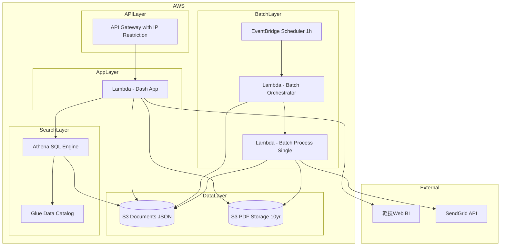
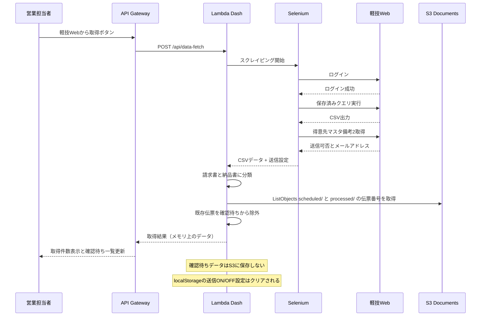
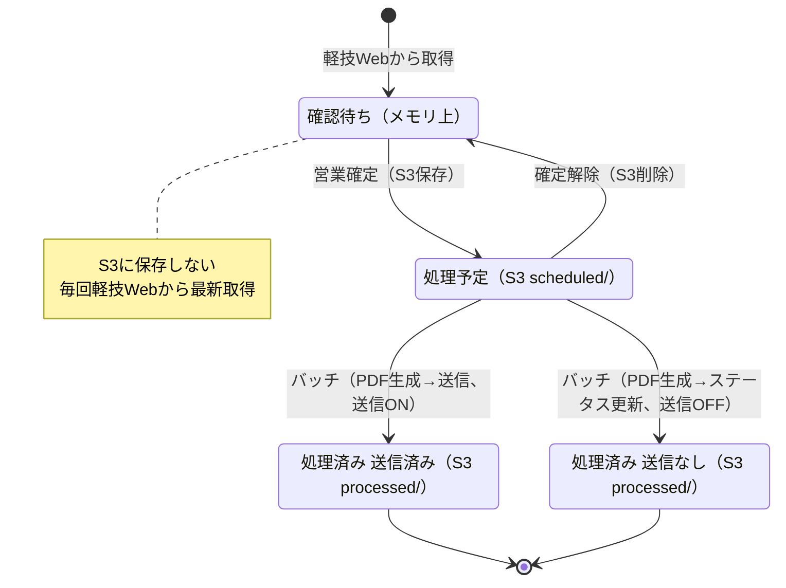
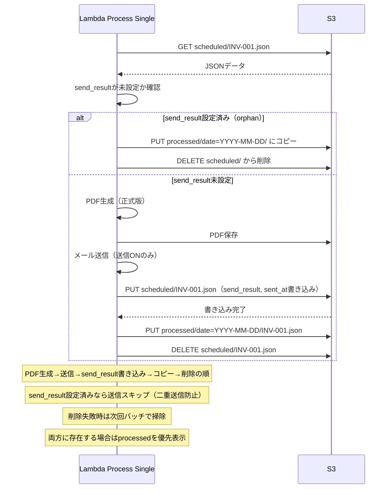
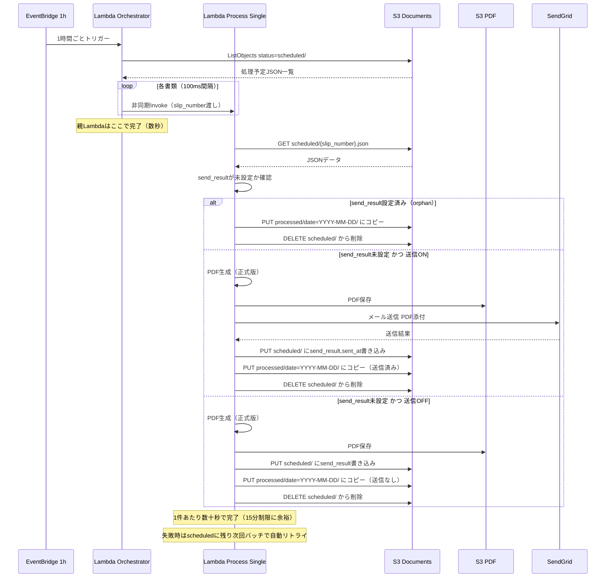
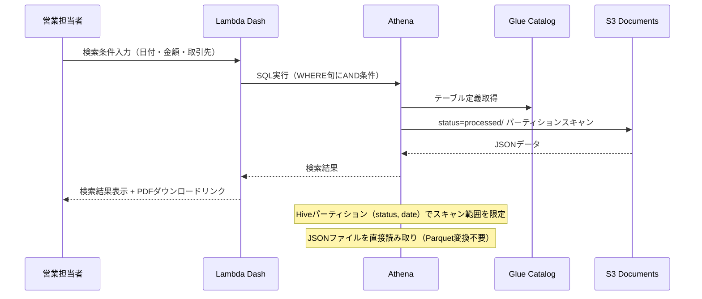
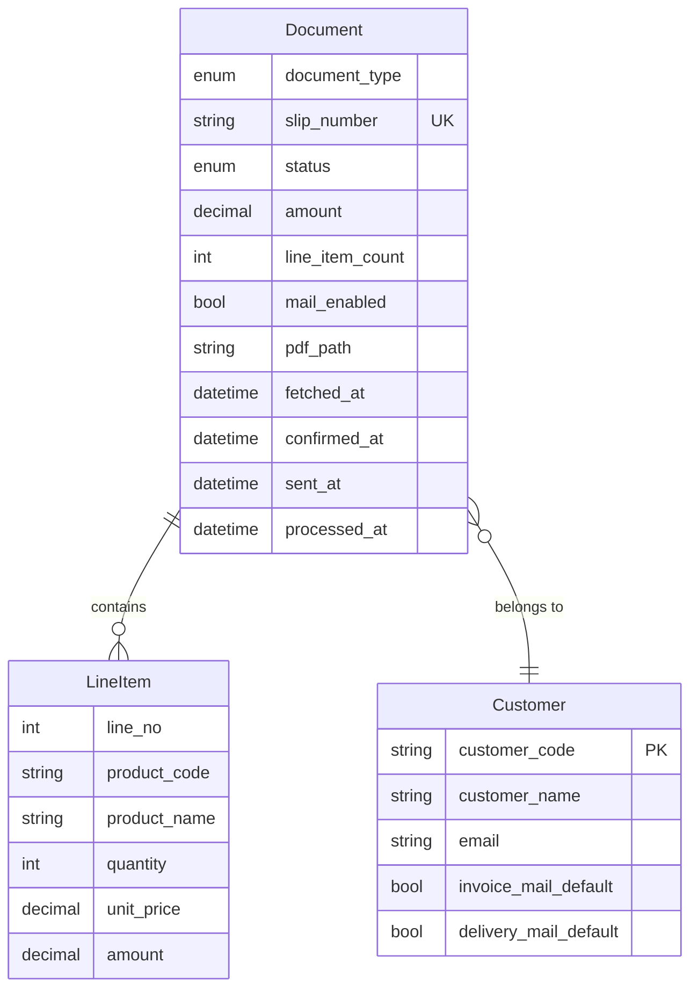

# Design Document

## Overview

**Purpose**: 本システムは、軽技Web（BIツール）から売上明細データを取得し、営業担当者による確認・確定を経て、請求書・納品書PDFを顧客にメール送信する業務効率化システムを提供する。電子帳簿保存法に準拠したPDF保存・検索機能を備える。

**Users**: 営業担当者7名が本システムを利用し、請求書・納品書の確認・送信業務を効率化する。

**Impact**: 現在の紙ベースの請求書・納品書発行業務をデジタル化し、手作業によるミスを削減、送信履歴の追跡を可能にする。電子帳簿保存法の検索要件を満たし、過去10年分の書類を検索可能にする。

### Goals
- 軽技Webから売上明細データを効率的に取得し、最新データを画面表示する
- 営業担当者による確認・確定フローを実現する
- 確定時にデータをスナップショットとしてS3にJSONファイルで保存する
- 確定済みデータから請求書・納品書PDFを自動生成する
- 1時間ごとに処理予定の書類をメール送信する（ADR-002）
- IP制限による低コストなアクセス制御を実現する
- 電子帳簿保存法に準拠したPDF検索機能を提供する（ADR-001）

### Non-Goals
- ログイン認証機能（IP制限のみで対応）
- ロールベースのアクセス制御
- 本システム内でのメール送信履歴管理（SendGrid管理画面で確認）
- 得意先マスタの本システム内での管理（軽技Webから取得）
- 営業担当者による明細データの編集（読み取り専用）
- 確認待ちデータのDB保存（常に軽技Webから最新取得）
- 部門選択機能（対象部門は1部門固定、ADR-001）
- 複数メールアドレス・CC/BCC対応（1社1アドレス、ADR-003）
- 送信結果サマリーの管理者通知（エラー時のみ担当営業に通知）
- 処理済み書類の取り消し・再送信機能
- システムによる改ざん防止措置（事務処理規程で対応、ADR-004）
- DynamoDBの使用（ADR-006: S3 + Athena構成に変更）
- Parquet等への変換処理（JSONファイルをAthenaで直接読み取り）

### データ保存方針
- **確認待ち**: S3/DBに保存しない。毎回軽技Webから最新データを取得（古いデータによる誤送信防止）
- **処理予定/処理済み**: 確定時にS3上のJSONファイルとして保存（Hiveパーティション形式、確定時点のスナップショット）
- **送信ON/OFF設定**: ブラウザのlocalStorageに保存。データ再取得時は備考2のデフォルト値に戻す（localStorageの設定はクリア）
- **PDF控え・処理済みデータ**: 10年間保存（電子帳簿保存法対応、ADR-005）

## Architecture

### Architecture Pattern & Boundary Map



**Architecture Integration**:
- Selected pattern: サーバーレスアーキテクチャ -- 完全従量課金でコスト最小化、運用負荷軽減
- Domain/feature boundaries: エッジ層（API Gateway + IP制限）、アプリ層（Lambda + Dash）、データ層（S3 JSON + S3 PDF）、検索層（Athena + Glue）、バッチ層（Lambda + EventBridge 1時間間隔）を分離
- Existing patterns preserved: 該当なし（新規開発）
- New components rationale: 全コンポーネントがサーバーレスで使用時のみ課金。DynamoDBを廃止しS3 + Athenaに置き換え（ADR-006）
- Steering compliance: AWS環境使用の方針に準拠、コスト最小化を実現

### Technology Stack

| Layer | Choice / Version | Role in Feature | Notes |
|-------|------------------|-----------------|-------|
| Frontend | Dash (Plotly) 2.x / Python 3.12 | 管理画面UI | Pythonのみで迅速な開発、Lambda対応、業務アプリに最適 |
| Backend | Dash + Flask (内蔵) | REST API、ビジネスロジック | DashはFlaskベース、追加フレームワーク不要 |
| ASGI Adapter | Mangum | Lambda対応 | ASGI/WSGIアプリをLambdaで実行 |
| Data / Storage | AWS S3 (JSON) | 書類データの永続化（Hiveパーティション形式） | ListObjectsV2で処理予定/処理済み一覧取得、DynamoDB廃止（ADR-006） |
| File Storage | AWS S3 | PDF保存（10年間） | Presigned URLでセキュアなアクセス、S3ライフサイクルポリシー設定 |
| Search | Amazon Athena + Glue Data Catalog | 電帳法対応の複合検索（日付・金額・取引先名） | JSONファイル直接読み取り、$5/TBスキャン、Parquet変換不要 |
| Email | SendGrid API v3 | メール送信 | 添付ファイル対応、送信履歴はSendGrid管理画面で確認 |
| Scraping | Selenium 4.x (headless Chrome) | 軽技Webスクレイピング | Lambda Layer使用、または別Lambda |
| PDF Generation | WeasyPrint 60+ | 請求書・納品書PDF生成 | HTML/CSSテンプレートベース |
| Batch | AWS Lambda + EventBridge | 1時間ごとのメール送信（ADR-002） | サーバーレス、cron式スケジュール |
| Infrastructure | AWS Lambda + API Gateway | 完全サーバーレス | IP制限はAPI Gatewayリソースポリシーで実現 |
| Deploy | AWS SAM | IaCデプロイ | template.yamlで構成管理 |

### コスト見積もり（月額）

| リソース | 想定利用量 | コスト |
|----------|-----------|--------|
| Lambda | 10,000リクエスト/月 | $0.20 |
| API Gateway | 10,000リクエスト/月 | $0.035 |
| S3 (Documents JSON) | 1GB保存、10,000リクエスト | $0.50 |
| S3 (PDF) | 1GB保存、1,000リクエスト | $0.50 |
| Athena | 月数回の検索、10MB最小課金/クエリ | $0.01未満 |
| Glue Data Catalog | テーブル定義のみ | 無料枠内 |
| **合計** | | **約$1.5/月** |

Note: Athenaは$5/TBスキャンの従量課金。10年分のJSONデータは数GB程度であり、1クエリあたり10MB最小課金（$0.00005）で実質無料レベル。DynamoDB廃止によりコスト削減。

## System Flows

### データ取得フロー



### 確認・確定・送信フロー



### ステータス変更フロー（S3 Copy + Delete）



### メールバッチ送信フロー



### 電帳法検索フロー（Athena）



## Requirements Traceability

| Requirement | Summary | Components | Interfaces | Flows |
|-------------|---------|------------|------------|-------|
| 1.1-1.8 | 確認待ちデータ取得 | DataFetchService, ScrapingService | DataFetchAPI | データ取得フロー |
| 2.1-2.11 | 確認待ち一覧 | PendingDocumentsSection, DataFetchService | DataFetchAPI, DocumentAPI | 確認・確定・送信フロー |
| 3.1-3.7 | 処理予定一覧 | ScheduledDocumentsSection, DocumentService | DocumentAPI | 確認・確定・送信フロー |
| 4.1-4.4 | 処理済み一覧 | ProcessedDocumentsSection, DocumentService | DocumentAPI | - |
| 5.1-5.7 | PDF検索機能（電帳法） | PdfSearchSection, PdfSearchService | PdfSearchAPI | 電帳法検索フロー |
| 6.1-6.7 | PDF生成 | PdfGenerationService | PdfAPI | 確認・確定・送信フロー |
| 7.1-7.13 | メールバッチ送信 | BatchOrchestratorService, BatchProcessSingleService, EmailService | BatchJob | メールバッチ送信フロー |
| 8.1-8.6 | 備考2フィールド管理 | ScrapingService | DataFetchAPI | データ取得フロー |
| 9.1-9.5 | アクセス制御 | SecurityMiddleware | - | - |
| 10.1-10.4 | 電子帳簿保存法対応 | PdfSearchService, S3 Storage, Athena | PdfSearchAPI | 電帳法検索フロー |

## Components and Interfaces

| Component | Domain/Layer | Intent | Req Coverage | Key Dependencies | Contracts |
|-----------|--------------|--------|--------------|------------------|-----------|
| ScrapingService | Backend/Service | 軽技Webからデータ取得と備考2解析 | 1.1-1.3, 1.6-1.7, 8.1-8.6 | Selenium (P0), 軽技Web (P0) | Service |
| DataFetchService | Backend/Service | データ取得オーケストレーション | 1.1-1.8, 2.1 | ScrapingService (P0), DocumentStorage (P0) | Service, API |
| DocumentService | Backend/Service | 書類管理・確定処理 | 2.9-2.11, 3.1-3.7, 4.1-4.4 | DocumentStorage (P0) | Service, API |
| PdfSearchService | Backend/Service | PDF検索（電帳法対応、Athena使用） | 5.1-5.7, 10.1-10.2 | Athena (P0), S3Client (P0) | Service, API |
| PdfGenerationService | Backend/Service | PDF生成 | 6.1-6.7 | WeasyPrint (P0), S3Client (P0) | Service |
| BatchOrchestratorService | Backend/Service | バッチオーケストレーター（親Lambda） | 7.1, 7.6 | DocumentStorage (P0), Lambda Client (P0) | Batch |
| BatchProcessSingleService | Backend/Service | 1件処理（子Lambda） | 7.1-7.13 | PdfGenerationService (P0), EmailService (P0), DocumentStorage (P0) | Batch |
| EmailService | Backend/Service | メール送信 | 7.2, 7.4-7.5, 7.9-7.12 | SendGrid (P0) | Service |
| DocumentStorage | Backend/Data | S3ベースのデータアクセス | 2.9, 3.1-3.7, 4.1-4.4 | S3 (P0) | Service |
| MainPage | Frontend/UI | メイン画面 | 2.1-2.11, 3.1-3.7, 4.1-4.4 | DocumentService (P0) | - |
| PdfSearchPage | Frontend/UI | PDF検索画面 | 5.1-5.7 | PdfSearchService (P0) | - |
| SecurityMiddleware | Backend/Infra | IP制限 | 9.1-9.5 | API Gateway (P0) | - |

### Backend / Service Layer

#### ScrapingService

| Field | Detail |
|-------|--------|
| Intent | 軽技Webへのログイン、クエリ実行、CSV取得、得意先マスタ備考2からの送信可否・メールアドレス取得 |
| Requirements | 1.1, 1.2, 1.3, 1.6, 1.7, 8.1, 8.2, 8.4, 8.5, 8.6 |

**Responsibilities & Constraints**
- Seleniumヘッドレスブラウザで軽技Webにアクセス
- 保存済みクエリを実行してCSVをダウンロード
- 得意先マスタ備考2フィールドから送信可否デフォルト値（請求書/納品書それぞれ）とメールアドレスを取得
- 備考2が未設定または解析不能の場合はデフォルトで送信可（ON）として扱う
- 1社1アドレスのみ対応（複数アドレス・CC/BCCは非対応）
- ログイン失敗・データ取得エラー時は例外をスロー

**Dependencies**
- External: Selenium WebDriver -- ブラウザ自動化 (P0)
- External: 軽技Web -- BIツール (P0)

**Contracts**: Service [x]

##### Service Interface
```python
from typing import Optional
from pydantic import BaseModel
from enum import Enum

class ScrapingError(Enum):
    LOGIN_FAILED = "login_failed"
    QUERY_EXECUTION_FAILED = "query_execution_failed"
    CSV_DOWNLOAD_FAILED = "csv_download_failed"
    TIMEOUT = "timeout"

class CustomerMailSetting(BaseModel):
    customer_code: str
    customer_name: str
    customer_email: str  # 備考2フィールドから取得、1社1アドレス
    invoice_mail_enabled: bool  # 請求書の送信可否デフォルト値
    delivery_mail_enabled: bool  # 納品書の送信可否デフォルト値

class CsvData(BaseModel):
    headers: list[str]
    rows: list[list[str]]

class ScrapingResult(BaseModel):
    success: bool
    csv_data: Optional[CsvData]
    customer_settings: list[CustomerMailSetting]
    error: Optional[ScrapingError]
    error_message: Optional[str]

class ScrapingService:
    async def fetch_sales_data(
        self,
        keigi_credentials: dict[str, str]
    ) -> ScrapingResult:
        """
        売上明細データをCSV形式で取得（対象部門は固定）

        Preconditions:
        - keigi_credentialsにはusername, passwordが含まれる

        Postconditions:
        - 成功時: csv_dataに売上明細、customer_settingsに備考2解析結果
        - 失敗時: errorとerror_messageが設定される
        """
        ...

    async def fetch_customer_settings(
        self,
        keigi_credentials: dict[str, str]
    ) -> list[CustomerMailSetting]:
        """
        得意先マスタ備考2フィールドから送信可否設定を取得
        請求書/納品書の送信可否をそれぞれ判定
        未設定または解析不能の場合はデフォルトでTrue（送信ON）
        """
        ...
```

**Implementation Notes**
- Integration: AWS Lambda/ECS環境ではヘッドレスChromeのコンテナ化またはLayer追加が必要
- Validation: 軽技WebのUI変更に対応するためセレクタは設定ファイルで外部化。備考2フォーマットはお客様と取り決めの上、解析ロジックを実装
- Risks: スクレイピング処理時間が長い場合はLambda 15分制限に注意

---

#### DataFetchService

| Field | Detail |
|-------|--------|
| Intent | データ取得の全体オーケストレーション、CSV解析、画面表示用データ作成 |
| Requirements | 1.1-1.8 |

**Responsibilities & Constraints**
- ScrapingServiceを呼び出してCSVデータと得意先送信設定を取得
- CSVを解析し請求書データと納品書データに分類
- 備考2から取得した送信可否デフォルト値を各書類に適用（請求書・納品書それぞれ個別）
- S3上の処理予定（`status=scheduled/`）/処理済み（`status=processed/`）に存在する伝票番号を確認待ち一覧から除外
- 確認待ちデータをメモリ上で保持（S3には保存しない）
- 処理状態をフロントエンドに通知

**Dependencies**
- Inbound: Dash UI -- データ取得リクエスト (P0)
- Outbound: ScrapingService -- スクレイピング実行 (P0)
- Outbound: DocumentStorage -- 既存伝票番号の確認（S3 ListObjects） (P0)

**Contracts**: Service [x] / API [x]

##### Service Interface
```python
from pydantic import BaseModel
from datetime import datetime
from decimal import Decimal
from enum import Enum
from typing import Optional

class FetchStatus(Enum):
    IN_PROGRESS = "in_progress"
    COMPLETED = "completed"
    FAILED = "failed"

class PendingDocument(BaseModel):
    """確認待ち書類（メモリ上のみ、S3には保存しない）"""
    slip_number: str
    document_type: str  # "invoice" or "delivery"
    customer_code: str
    customer_name: str
    customer_email: str  # 備考2から取得
    sales_person: str
    amount: Decimal
    line_item_count: int
    mail_enabled: bool  # 備考2からのデフォルト値（請求書/納品書それぞれ個別）
    fetched_at: datetime
    line_items: list[dict]

class FetchResult(BaseModel):
    status: FetchStatus
    invoice_count: int
    delivery_count: int
    pending_documents: list[PendingDocument]  # 確認待ち一覧（メモリ上）
    error_message: Optional[str]
    fetched_at: datetime

class DataFetchService:
    async def fetch_data(self) -> FetchResult:
        """
        最新データを軽技Webから取得（対象部門は固定）

        Postconditions:
        - 成功時: pending_documentsに確認待ち書類リストが返される（S3には保存しない）
        - S3の処理予定/処理済みに存在する伝票番号は除外される
        - 失敗時: error_messageが設定される

        Note: 確認待ちデータは毎回最新を取得し、古いデータによる誤送信を防止する
        """
        ...
```

##### API Contract
| Method | Endpoint | Request | Response | Errors |
|--------|----------|---------|----------|--------|
| POST | /api/data-fetch | - | FetchResult | 500, 503 |
| GET | /api/data-fetch/status | - | FetchStatus | 500 |

---

#### DocumentService

| Field | Detail |
|-------|--------|
| Intent | 書類の確定処理、処理予定/処理済み一覧取得、ステータス管理 |
| Requirements | 2.9-2.11, 3.1-3.7, 4.1-4.4 |

**Responsibilities & Constraints**
- 処理予定の書類一覧を提供（S3 `status=scheduled/` からListObjectsで取得）
- 処理済みの書類一覧を提供（S3 `status=processed/date=YYYY-MM-DD/` を7日分ListObjectsで取得）
- 確認待ち一覧はDataFetchServiceから取得（メモリ上のデータ）
- 確定時にデータをスナップショットとしてS3にJSONファイルで保存し、PDF生成をトリガー
- 確定解除でS3からJSONファイルを削除（次回取得時に確認待ちに再表示される）

**Dependencies**
- Inbound: Dash UI -- 書類操作リクエスト (P0)
- Outbound: DocumentStorage -- S3データアクセス (P0)
- Outbound: PdfGenerationService -- PDF生成トリガー (P1)

**Contracts**: Service [x] / API [x]

##### Service Interface
```python
from enum import Enum
from decimal import Decimal
from datetime import datetime, date
from typing import Optional
from pydantic import BaseModel

class DocumentType(Enum):
    INVOICE = "invoice"
    DELIVERY = "delivery"

class DocumentStatus(Enum):
    # Note: 確認待ち(PENDING)はS3に保存しないため、このenumには含まれない
    SCHEDULED = "scheduled"         # 処理予定（確定済み、S3 scheduled/ に保存）
    # PDF_GENERATEDは不要（PDF生成はバッチ送信時に行う、ADR-006）
    SENT = "sent"                   # 処理済み（送信済み、S3 processed/ に移動）
    NOT_SENT = "not_sent"           # 処理済み（送信なし、S3 processed/ に移動）

class Document(BaseModel):
    document_type: DocumentType
    slip_number: str
    customer_code: str
    customer_name: str
    customer_email: str
    sales_person: str
    amount: Decimal
    line_item_count: int
    status: DocumentStatus
    mail_enabled: bool  # 確定時にlocalStorageの設定を含めて保存
    pdf_path: Optional[str]
    fetched_at: datetime
    confirmed_at: Optional[datetime]
    processed_at: Optional[datetime]
    line_items: list[LineItem]

class LineItem(BaseModel):
    line_no: int
    product_code: str
    product_name: str
    quantity: int
    unit_price: Decimal
    amount: Decimal

class DocumentFilter(BaseModel):
    document_type: Optional[DocumentType]
    sales_person: Optional[str]

class DocumentService:
    # 確認待ち書類はDataFetchServiceから取得（メモリ上のデータ）
    # このサービスでは処理予定/処理済み（S3保存済み）のみを扱う

    async def list_scheduled_documents(
        self,
        filter: DocumentFilter
    ) -> list[Document]:
        """
        処理予定書類一覧取得
        S3 status=scheduled/ をListObjectsで取得し、各JSONを読み取り
        """
        ...

    async def list_processed_documents(
        self,
        filter: DocumentFilter,
        days: int = 7
    ) -> list[Document]:
        """
        処理済み書類一覧取得（デフォルト過去7日間）
        S3 status=processed/date=YYYY-MM-DD/ を7日分ListObjectsで取得
        """
        ...

    async def get_document_detail(
        self,
        slip_number: str,
        document_type: DocumentType
    ) -> Document:
        """書類詳細取得（JSONファイルの全内容、読み取り専用）"""
        ...

    async def confirm_documents(
        self,
        pending_documents: list[PendingDocument],
        mail_settings: dict[str, bool]
    ) -> list[Document]:
        """
        書類確定（確認待ち -> 処理予定）

        Preconditions:
        - pending_documentsはDataFetchServiceから取得したメモリ上のデータ
        - mail_settingsはlocalStorageから取得した送信ON/OFF設定

        Postconditions:
        - 書類データがS3 status=scheduled/{slip_number}.json に保存される
        - mail_settingsの値がmail_enabledに反映される
        - ステータスがSCHEDULEDに設定される
        - PDF生成がトリガーされる
        """
        ...

    async def cancel_confirmation(
        self,
        slip_numbers: list[str],
        document_types: list[DocumentType]
    ) -> dict:
        """
        確定解除（処理予定 -> 削除）

        Postconditions:
        - S3 status=scheduled/ から該当JSONファイルを削除
        - 次回データ取得時に確認待ちに再表示される

        Returns:
        - {"deleted_count": int, "message": "確定を解除しました。確認待ちに表示するには「軽技Webから取得」を押してください"}
        """
        ...

    async def get_counts(self) -> dict:
        """件数取得（処理予定件数）: S3 ListObjectsでオブジェクト数をカウント"""
        ...
```

##### API Contract
| Method | Endpoint | Request | Response | Errors |
|--------|----------|---------|----------|--------|
| GET | /api/documents/scheduled | DocumentFilter (query) | list[Document] | 400, 500 |
| GET | /api/documents/processed | DocumentFilter (query) | list[Document] | 400, 500 |
| GET | /api/documents/{slip_number}/{document_type}/detail | - | Document | 404, 500 |
| POST | /api/documents/confirm | `{"pending_documents": [...], "mail_settings": {...}}` | list[Document] | 400, 500 |
| POST | /api/documents/cancel-confirmation | `{"slip_numbers": [...], "document_types": [...]}` | `{"deleted_count": int, "message": str}` | 400, 500 |
| GET | /api/documents/counts | - | counts | 500 |

**Note**: 確認待ち一覧は `/api/data-fetch` から取得（メモリ上のデータ、S3には保存されない）

---

#### PdfSearchService

| Field | Detail |
|-------|--------|
| Intent | 電子帳簿保存法に準拠したPDF検索機能を提供（Athena使用） |
| Requirements | 5.1-5.7, 10.1, 10.2 |

**Responsibilities & Constraints**
- 過去10年分の処理済み書類をAthenaのSQL検索で提供（電子帳簿保存法対応）
- 取引年月日（範囲指定）、取引金額（範囲指定）、取引先名での検索
- 条件の組み合わせ検索（AND条件）をSQLのWHERE句で実現
- 通常の画面表示（処理予定・処理済み一覧）ではAthenaは使用しない
- 検索結果からPDFをダウンロード可能

**Dependencies**
- Outbound: Athena (boto3 athena client) -- SQL実行 (P0)
- Outbound: Glue Data Catalog -- テーブル定義参照 (P0)
- Outbound: S3 Client -- PDFダウンロードURL生成、Athena結果取得 (P0)

**Contracts**: Service [x] / API [x]

##### Service Interface
```python
from pydantic import BaseModel
from datetime import date, datetime
from decimal import Decimal
from typing import Optional

class PdfSearchCriteria(BaseModel):
    """電子帳簿保存法の検索要件に基づく検索条件"""
    date_from: Optional[date]       # 取引年月日（開始）
    date_to: Optional[date]         # 取引年月日（終了）
    amount_from: Optional[Decimal]  # 取引金額（下限）
    amount_to: Optional[Decimal]    # 取引金額（上限）
    customer_name: Optional[str]    # 取引先名（部分一致）

class PdfSearchResult(BaseModel):
    document_type: str  # "invoice" or "delivery"
    slip_number: str
    customer_name: str
    amount: Decimal
    processed_at: datetime
    send_result: str  # "送信済み" or "送信なし"
    pdf_download_url: Optional[str]

class PdfSearchService:
    async def search_documents(
        self,
        criteria: PdfSearchCriteria,
        limit: int = 100,
        offset: int = 0
    ) -> tuple[list[PdfSearchResult], int]:
        """
        電子帳簿保存法に準拠した書類検索（Athena SQL使用）

        Preconditions:
        - 少なくとも1つの検索条件が指定されている

        Postconditions:
        - Athenaで status=processed/ パーティション内のJSONを検索
        - WHERE句で日付範囲、金額範囲、取引先名（LIKE）をAND条件で結合
        - pdf_download_urlはS3 Presigned URL
        - 結果はprocessed_atの降順

        Returns:
        - (検索結果リスト, 総件数)
        """
        ...

    async def get_pdf_download_url(
        self,
        slip_number: str,
        document_type: str
    ) -> str:
        """S3 Presigned URLを生成（有効期限1時間）"""
        ...
```

##### API Contract
| Method | Endpoint | Request | Response | Errors |
|--------|----------|---------|----------|--------|
| GET | /api/pdf-search | PdfSearchCriteria (query) | `{"results": [...], "total": int}` | 400, 500 |
| GET | /api/pdf-search/{slip_number}/{document_type}/download | - | `{"download_url": str}` | 404, 500 |

**Implementation Notes**
- Integration: AthenaのStartQueryExecution + GetQueryResults APIを使用。結果はS3に出力されるため、Athena結果用S3バケット/プレフィックスを設定。boto3のAthenaクライアントでポーリングまたはウェイターで完了待ち
- Validation: 日付範囲は10年以内、金額は正の値のみ
- Risks: Athenaクエリの実行時間（数秒～十数秒）。JSONフォーマットのためColumnar（Parquet）より遅いが、データ量が小さいため許容範囲

---

#### PdfGenerationService

| Field | Detail |
|-------|--------|
| Intent | 請求書・納品書PDFをテンプレートから生成。バッチ送信時の正式版生成とプレビュー生成の2モードを提供 |
| Requirements | 6.1-6.7 |

**Responsibilities & Constraints**
- WeasyPrintでHTML/CSSテンプレートからPDF生成
- 会社ロゴ、宛先、明細、合計金額を含むレイアウト
- 請求書用と納品書用で異なるテンプレートを使用
- 明細が1ページに収まらない場合は改ページ処理
- **正式版PDF**: バッチ送信時に生成し、S3に保存（10年間保存、上書き・削除しない運用）
- **プレビューPDF**: 処理予定一覧のプレビューボタン押下時にオンデマンド生成。S3には保存しない。タイトルに「プレビュー」文言を含める
- PDF生成は確定時には行わない（バッチ送信時に行う。ADR-006）
- 生成失敗時はエラーログを記録し担当営業にメール通知

**Dependencies**
- Outbound: WeasyPrint -- PDF生成ライブラリ (P0)
- Outbound: S3 Client -- 正式版PDFの保存 (P0)
- Outbound: EmailService -- エラー時の担当営業通知 (P1)

**Contracts**: Service [x]

##### Service Interface
```python
class PdfGenerationResult(BaseModel):
    success: bool
    pdf_path: Optional[str]  # S3パス（正式版のみ）
    pdf_bytes: Optional[bytes]  # PDFバイナリ（プレビュー・送信用）
    error_message: Optional[str]

class PdfGenerationService:
    async def generate_pdf(
        self,
        document: Document,
        line_items: list[LineItem],
        preview: bool = False
    ) -> PdfGenerationResult:
        """
        請求書または納品書PDFを生成

        Args:
        - preview=False（正式版）: S3に保存、pdf_pathを返す
        - preview=True（プレビュー）: S3に保存しない、pdf_bytesを返す、タイトルに「プレビュー」文言

        Postconditions:
        - 正式版: pdf_pathにS3パスが設定される。保存後は上書き・削除しない
        - プレビュー: pdf_bytesにPDFバイナリが設定される
        - 失敗時: error_messageが設定され、担当営業にメール通知
        """
        ...

    async def get_pdf_download_url(
        self,
        pdf_path: str,
        expiration_seconds: int = 3600
    ) -> str:
        """S3 Presigned URLを生成（処理済み一覧のダウンロード用）"""
        ...
```

**Implementation Notes**
- Integration: PDF生成は非同期で実行し、完了後にS3上のJSONファイルのステータス更新。テンプレートにはJinja2を使用
- Validation: 必須フィールドの存在検証、改ページ位置の計算
- Risks: 大量生成時のメモリ使用量に注意、必要に応じてバッチ分割

---

#### BatchOrchestratorService（親Lambda）

| Field | Detail |
|-------|--------|
| Intent | 処理予定書類を列挙し、1件ずつ子Lambdaを非同期Invokeする（ADR-008） |
| Requirements | 7.1, 7.6 |

**Responsibilities & Constraints**
- 1時間ごとにEventBridgeからトリガー（ADR-002）
- 土日祝日を含め毎日稼働（祝日カレンダー不要）
- S3 `status=scheduled/` からListObjectsで処理予定JSONのキー一覧を取得
- 1件ずつ子Lambda（BatchProcessSingleService）を非同期Invoke（100ms間隔、SendGridレート制限対策）
- 親Lambda自体は数秒で完了

**Dependencies**
- Inbound: EventBridge Scheduler -- 1時間ごとのトリガー (P0)
- Outbound: DocumentStorage -- S3キー一覧取得 (P0)
- Outbound: Lambda Client -- 子Lambdaの非同期Invoke (P0)

**Contracts**: Batch [x]

##### Batch / Job Contract
- Trigger: EventBridge Scheduler cron式 `0 * * * ? *` (毎時0分、1時間間隔)
- Input / validation: なし（EventBridgeトリガーのみ）
- Output / destination: 子Lambdaを非同期Invoke

---

#### BatchProcessSingleService（子Lambda）

| Field | Detail |
|-------|--------|
| Intent | 1件の書類に対してPDF生成→送信→ステータス変更を実行 |
| Requirements | 7.1-7.13 |

**Responsibilities & Constraints**
- 親LambdaからInvokeされ、1件の書類（slip_number）を処理
- send_result設定済みならorphanクリーンアップ（コピー+削除のみ）
- 送信ONの書類: PDF生成→EmailServiceでメール送信→send_result書き込み→processedにコピー→scheduledから削除
- 送信OFFの書類: PDF生成→send_result書き込み→processedにコピー→scheduledから削除
- エラー時のみ担当営業にメール通知
- 送信専用アドレスを使用（全社共通の1アドレス）
- 1件あたり数十秒で完了（15分制限に余裕）
- 失敗した書類はscheduledに残り、次回バッチで自動リトライ

**Dependencies**
- Inbound: 親Lambda -- 非同期Invoke (P0)
- Outbound: DocumentStorage -- S3データアクセス (P0)
- Outbound: PdfGenerationService -- PDF生成 (P0)
- Outbound: EmailService -- メール送信 (P0)
- Outbound: S3 Client -- PDF保存 (P0)

**Contracts**: Batch [x]

##### Batch / Job Contract
- Trigger: 親Lambdaからの非同期Invoke
- Input / validation: slip_number（S3キーの一部）
- Output / destination: SendGrid経由でメール送信（送信ONのみ）、S3 `status=processed/` にコピー後 `status=scheduled/` から削除
- Idempotency & recovery:
  - scheduled側JSONのsend_resultが設定済みなら送信スキップ（二重送信防止）
  - 手順: ①PDF生成 ②送信 ③send_result書き込み ④processedにコピー ⑤scheduledから削除
  - 削除失敗時は次回バッチでsend_result設定済みのorphanをコピー+削除（クリーンアップ）
  - scheduledとprocessedの両方に存在する場合はprocessedを優先表示
  - 最大リトライ回数: 3回
  - リトライ間隔: 指数バックオフ

##### Service Interface
```python
# 親Lambda（オーケストレーター）
class OrchestratorResult(BaseModel):
    scheduled_count: int    # scheduled/内の書類数
    invoked_count: int      # 子Lambdaを起動した件数
    executed_at: datetime

class BatchOrchestratorService:
    async def orchestrate(self) -> OrchestratorResult:
        """
        処理予定の書類を列挙し、1件ずつ子Lambdaを非同期Invokeする

        手順:
        1. S3 status=scheduled/ をListObjectsで一覧取得
        2. 各slip_numberに対して子Lambdaを非同期Invoke（100ms間隔）
        """
        ...

# 子Lambda（1件処理）
class ProcessSingleResult(BaseModel):
    slip_number: str
    send_result: Optional[str]  # "sent", "not_sent", or None (failure)
    error_message: Optional[str]

class BatchProcessSingleService:
    async def process(self, slip_number: str) -> ProcessSingleResult:
        """
        1件の書類を処理する

        手順:
        1. scheduled/{slip_number}.json を読み取り
        2. send_result設定済みならorphanクリーンアップ（コピー+削除のみ）
        3. PDF生成（正式版、S3に保存）
        4. 送信ONならメール送信
        5. send_result（+ 送信ONならsent_at）をscheduled側JSONに書き込み
        6. processed/date=YYYY-MM-DD/ にコピー
        7. scheduled/ から削除
        8. 失敗時はエラーログ記録、担当営業にメール通知
        """
        ...
```

**Implementation Notes**
- Integration: 親子Lambda構成により15分制限を回避（ADR-008）。1件あたり数十秒で完了
- Validation: PDF生成前にJSONデータの必須フィールド確認
- Risks: SendGridレート制限対策として親Lambdaで100ms間隔でInvoke。子Lambda内でも429エラー時はリトライ

---

#### EmailService

| Field | Detail |
|-------|--------|
| Intent | SendGrid APIを使用したメール送信 |
| Requirements | 7.2, 7.4, 7.5, 7.9, 7.10, 7.11, 7.12 |

**Responsibilities & Constraints**
- SendGrid Python SDKでメール送信
- PDF添付ファイルのbase64エンコード
- 送信専用アドレスを使用し、返信があった場合は送信専用である旨の自動返信を設定
- メールの件名に伝票番号・得意先名を含む
- メールの件名・本文テンプレートはお客様に用意していただく（種類は1種類のみ）
- 送信元メールアドレスは全社共通の1アドレス
- 送信エラー時のリトライ処理

**Dependencies**
- External: SendGrid API v3 -- メール送信 (P0)

**Contracts**: Service [x]

##### Service Interface
```python
class EmailAttachment(BaseModel):
    filename: str
    content: bytes
    content_type: str = "application/pdf"

class EmailRequest(BaseModel):
    to_email: str
    to_name: str
    subject: str  # 伝票番号・得意先名を含む形式
    body_html: str
    attachments: list[EmailAttachment]

class EmailResult(BaseModel):
    success: bool
    message_id: Optional[str]
    error_message: Optional[str]

class EmailService:
    async def send_email(
        self,
        request: EmailRequest
    ) -> EmailResult:
        """
        メールを送信

        Preconditions:
        - to_emailは有効なメールアドレス
        - attachmentsの各contentはバイナリデータ
        - 送信元アドレスは全社共通の送信専用アドレス

        Postconditions:
        - 成功時: message_idが設定される
        - 失敗時: error_messageが設定される
        """
        ...

    async def send_error_notification(
        self,
        sales_person_email: str,
        subject: str,
        body: str
    ) -> EmailResult:
        """担当営業へのエラー通知メール送信"""
        ...
```

**Implementation Notes**
- Integration: APIキーは環境変数`SENDGRID_API_KEY`から取得。送信専用アドレスはSendGridで事前検証が必要
- Validation: メールアドレスの形式検証。件名テンプレートに伝票番号・得意先名を埋め込み
- Risks: レート制限（429エラー）時は指数バックオフでリトライ

---

### Backend / Data Layer

#### DocumentStorage

| Field | Detail |
|-------|--------|
| Intent | S3ベースの書類データCRUD操作（Hiveパーティション形式） |
| Requirements | 2.9, 3.1-3.7, 4.1-4.4 |

**Responsibilities & Constraints**
- S3をデータストアとして使用（DynamoDB廃止、ADR-006）
- S3パス構成:
  - `documents/status=scheduled/{slip_number}.json`（dateなし、件数が少ないため不要）
  - `documents/status=processed/date=YYYY-MM-DD/{slip_number}.json`（送信日、ListObjectsで日付絞り込み用）
- 処理予定一覧: `status=scheduled/` をListObjectsV2で全件取得
- 処理済み一覧（過去1週間）: `status=processed/date=YYYY-MM-DD/` を7日分ListObjectsV2で取得
- ステータス変更手順: ①PDF生成 ②送信 ③send_resultをscheduled側JSONに書き込み ④processed側にコピー ⑤scheduled側を削除
- 二重送信防止: scheduled側JSONのsend_resultで判断（processed側の確認不要）
- 同じ伝票番号がscheduledとprocessedの両方に存在する場合はprocessedを優先表示
- 削除失敗時は次回バッチで掃除

**Dependencies**
- External: AWS S3 (boto3 s3 client) -- オブジェクトストレージ (P0)

**Contracts**: Service [x]

##### Service Interface
```python
import boto3
from datetime import date, datetime
from typing import Optional

class DocumentStorage:
    def __init__(self, bucket_name: str, prefix: str = "documents"):
        self.s3_client = boto3.client('s3')
        self.bucket_name = bucket_name
        self.prefix = prefix

    def _build_scheduled_key(self, slip_number: str) -> str:
        """
        scheduled側のS3キーを構築
        例: documents/status=scheduled/INV-001.json
        """
        return f"{self.prefix}/status=scheduled/{slip_number}.json"

    def _build_processed_key(self, processed_date: date, slip_number: str) -> str:
        """
        processed側のS3キーを構築
        例: documents/status=processed/date=2026-04-03/INV-001.json
        """
        return f"{self.prefix}/status=processed/date={processed_date.isoformat()}/{slip_number}.json"

    async def save_document(
        self,
        document: Document
    ) -> str:
        """
        書類JSONをS3に保存（確定時）

        Postconditions:
        - documents/status=scheduled/{slip_number}.json に保存
        - S3キーを返す
        """
        ...

    async def get_scheduled_document(
        self,
        slip_number: str
    ) -> Optional[Document]:
        """scheduled側のS3からJSONを読み取り"""
        ...

    async def list_scheduled_documents(self) -> list[Document]:
        """
        処理予定一覧を取得
        status=scheduled/ の全JSONを取得し、中身を読み取って返す
        send_resultが設定済みのものはprocessed優先表示のため除外
        """
        ...

    async def list_processed_documents(
        self,
        days: int = 7
    ) -> list[Document]:
        """
        処理済み一覧を取得（過去N日分）
        status=processed/date=YYYY-MM-DD/ を日数分ListObjectsV2で取得
        """
        ...

    async def get_existing_slip_numbers(self) -> set[str]:
        """
        処理予定/処理済みの全伝票番号を取得（確認待ち除外用）
        scheduled/ と processed/ の両方をListObjectsV2でキー一覧取得
        キーからslip_numberを抽出（JSONの中身は読まない）
        """
        ...

    async def mark_as_processed(
        self,
        slip_number: str,
        send_result: str,
        sent_at: Optional[datetime] = None
    ) -> bool:
        """
        scheduled側のJSONにsend_resultを書き込む（処理済みの証拠）
        send_result: "sent" or "not_sent"
        sent_at: 送信ONの場合のみ設定
        processedへのコピー前に実行する
        """
        ...

    async def move_to_processed(
        self,
        slip_number: str,
        processed_date: date,
        updated_document: Document
    ) -> bool:
        """
        ステータス変更: scheduled -> processed

        手順（バッチ処理から呼ばれる前にmark_as_sentが実行済みであること）:
        1. processed/date=YYYY-MM-DD/ にJSONを書き込み
        2. scheduled/ から元ファイルを削除
        3. 削除失敗時はFalseを返す（次回バッチで掃除）

        Returns: 削除成功したかどうか
        """
        ...

    async def delete_scheduled_document(
        self,
        slip_number: str
    ) -> bool:
        """scheduled側のJSONファイルを削除（確定解除用）"""
        ...

    async def cleanup_orphans(self) -> int:
        """
        orphanクリーンアップ:
        scheduled側でsend_resultが設定済みのファイルについて、
        processedへのコピー+scheduled側の削除を再試行する

        Returns: 掃除した件数
        """
        ...

    async def update_scheduled_json(
        self,
        slip_number: str,
        updates: dict
    ) -> bool:
        """
        scheduled側のJSONを読み取り、フィールドを更新して書き戻す
        （バッチ送信時のsend_result, sent_at, pdf_path書き込み等に使用）
        """
        ...
```

**Implementation Notes**
- Integration: boto3 Paginatorを使用してListObjectsV2のページネーションに対応。JSONの読み書きにはjsonモジュールとDecimalのカスタムシリアライザを使用
- Validation: S3キーの命名規則を厳格に管理。日付フォーマットはISO 8601
- Risks: ListObjectsV2は1回あたり最大1000件。通常の日次20-30件では問題ないが、月末ピーク時（250件）でもscheduled/には数百件程度で十分処理可能

---

### Backend / Infrastructure

#### SecurityMiddleware

| Field | Detail |
|-------|--------|
| Intent | IP制限によるアクセス制御 |
| Requirements | 9.1-9.5 |

**Responsibilities & Constraints**
- 許可されたIPアドレスリストとの照合（VPN接続前提、複数拠点対応）
- 非許可IPからのアクセス拒否（403 Forbidden）
- ログイン画面なし、ロール制御なし（全ユーザーが全機能を利用可能）
- 既存ドメインのサブドメインで公開（新規ドメインは発行しない）

**Implementation Notes**
- Integration: API GatewayのリソースポリシーでIP制限を実現（追加コストなし）
- Risks: WAFのIP制限はより柔軟だが月$5程度の追加コスト

---

### Frontend / UI Layer (Dash)

#### MainPage

| Field | Detail |
|-------|--------|
| Intent | メイン画面（確認待ち/処理予定/処理済みセクション） |
| Requirements | 2.1-2.11, 3.1-3.7, 4.1-4.4 |

**Summary-only**: 部門選択画面は不要（ADR-001により1部門固定）。メイン画面にアクセスすると直接確認待ち一覧を表示。

**確認待ちセクション** (2.1-2.11):
- 請求書・納品書のタブ切り替え表示
- dash_table.DataTableによる一覧表示（伝票番号、顧客名、営業担当、送信ON/OFF、合計金額、明細数、取得日）
- 営業担当フィルター
- 送信ON/OFFトグル（備考2のデフォルト値が初期値、変更はlocalStorageに保存）
- データ再取得時はlocalStorageの設定をクリアし備考2のデフォルト値に戻す
- 詳細ボタン -> モーダルで明細一覧表示（読み取り専用、編集不可）
- 複数書類選択と確定ボタン（確定時にスナップショット + localStorageの送信ON/OFF設定をS3に保存、該当エントリをlocalStorageから削除）
- ステータスカウント表示（請求書/納品書の確認待ち件数）

**処理予定セクション** (3.1-3.7):
- S3保存済みの確定済み書類一覧（種別、伝票番号、顧客名、営業担当、送信ON/OFF、金額、確定日時）
- 送信ON/OFFをON/OFFバッジ（テキスト表示）で表示（確定時に保存された値）
- PDFプレビューボタン（押下時にオンデマンドでPDF生成、S3には保存しない。タイトルに「プレビュー」文言）
- 複数書類選択と確定解除ボタン
- 確定解除後メッセージ表示
- 処理予定件数のステータスカウント

**処理済みセクション** (4.1-4.4):
- 過去1週間の処理済み書類一覧（種別、伝票番号、顧客名、営業担当、送信結果、金額、処理日時）
- PDFダウンロードボタン
- 取り消し・再送信機能なし

**送信ON/OFF設定のlocalStorage管理**:
```javascript
// localStorageキー: "mail_settings"
// 構造: { "INV-2026-001": false, "DEL-2026-003": true, ... }

// ON/OFF変更時に保存
localStorage.setItem("mail_settings", JSON.stringify(settings));

// データ再取得時はlocalStorageをクリアし、備考2のデフォルト値に戻す
localStorage.removeItem("mail_settings");

// 確定時に該当エントリを削除
confirmedSlipNumbers.forEach(slip => delete savedSettings[slip]);
localStorage.setItem("mail_settings", JSON.stringify(savedSettings));
```

**バッチ処理中の制御** (7.7):
- バッチ処理実行中ステータスを表示
- バッチ処理中のデータ編集を制限

---

#### PdfSearchPage

| Field | Detail |
|-------|--------|
| Intent | PDF検索画面（電子帳簿保存法対応） |
| Requirements | 5.1-5.7, 10.1, 10.2 |

**Summary-only**: メイン画面とは別タブまたはナビゲーションで遷移。

**検索条件**:
- 取引年月日（範囲指定）: dcc.DatePickerRange
- 取引金額（範囲指定）: dcc.Input x 2
- 取引先名: dcc.Input（部分一致検索）
- 条件の組み合わせ検索（AND条件）

**検索結果表示**:
- dash_table.DataTableで表示（種別、伝票番号、顧客名、金額、処理日時、送信結果）
- 各行にPDFダウンロードボタン
- 過去10年分のデータを対象（Athena SQLで検索）

---

## Data Models

### Domain Model



**Business Rules & Invariants**:
- 伝票番号（slip_number）+ document_typeでシステム全体で一意
- 対象部門は1部門固定（ADR-001）
- **確認待ち**: 軽技Webから毎回取得、S3には保存しない（古いデータによる誤送信防止）
- **確定時**: データをスナップショットとしてS3にJSONファイルで保存（処理予定ステータス）、localStorageの送信ON/OFF設定を反映
- ステータス遷移（S3保存後）: SCHEDULED -> SENT/NOT_SENT（PDF生成はバッチ送信時に実施、ADR-006）
- ステータス変更時のS3操作: ①PDF生成 ②送信 ③send_result書き込み ④processedにコピー ⑤scheduledから削除
- 同じ伝票番号がscheduledとprocessedの両方に存在する場合はprocessedを優先
- 確定解除: S3からJSONファイル削除（次回取得時に確認待ちに再表示）
- mail_enabledがfalseの書類はメール送信されないがステータスはNOT_SENTに更新
- 得意先1社につきメールアドレスは1件（備考2フィールドで管理、ADR-003）
- PDF控えは10年間保存、上書き・削除しない（ADR-004, ADR-005）

### Logical Data Model

**Structure Definition**:
- Document: 書類のヘッダー情報と明細をまとめた1つのJSONファイル（1ファイル=1書類）
- LineItem: 書類の明細行（Document JSON内に埋め込み）
- Customer: 得意先マスタ（軽技Webの備考2フィールドから都度取得、S3には保存しない）

**Consistency & Integrity**:
- ステータス変更はS3 Copy + Deleteで実装（アトミックではない）
- PDF生成→送信→send_result書き込み→コピー→削除の順。send_result設定済みなら送信スキップで二重送信防止（結果整合性）
- scheduledとprocessedの両方に存在する場合はprocessedを優先表示（画面側のロジック）

### Physical Data Model

**For S3 (JSON with Hive Partitions)**:

#### S3ファイル構成

```
{bucket}/
  documents/
    status=scheduled/           ← dateなし（件数が少ないため不要）
      INV-2026-001.json
      DEL-2026-001.json
      INV-2026-002.json
    status=processed/           ← 送信日でパーティション
      date=2026-03-30/
        INV-2026-003.json
      date=2026-03-29/
        INV-2026-004.json
  pdfs/
    invoices/
      2026/03/30/
        INV-2026-001.pdf
    deliveries/
      2026/03/30/
        DEL-2026-001.pdf
```

#### JSONファイル構造

```json
{
  "slip_number": "INV-2026-001",
  "document_type": "invoice",
  "customer_code": "C001",
  "customer_name": "株式会社サンプル",
  "customer_email": "sample@example.com",
  "sales_person": "田中 太郎",
  "status": "scheduled",
  "amount": 150000,
  "line_item_count": 3,
  "mail_enabled": true,
  "pdf_path": null,
  "fetched_at": "2026-01-27T10:00:00+09:00",
  "confirmed_at": "2026-01-27T14:30:00+09:00",
  "sent_at": null,
  "processed_at": null,
  "send_result": null,
  "line_items": [
    {
      "line_no": 1,
      "product_code": "P001",
      "product_name": "製品A",
      "quantity": 10,
      "unit_price": 15000,
      "amount": 150000
    }
  ]
}
```

**Note**: 確認待ちデータはS3に保存しない。確定時にスナップショットとして保存され、statusは"scheduled"から始まる。処理済みに移動する際、statusは"sent"または"not_sent"に更新される。

#### 一覧取得方式

| ユースケース | 方式 | S3プレフィックス | 備考 |
|-------------|------|-----------------|------|
| 処理予定一覧 | S3 ListObjectsV2 | `documents/status=scheduled/` | 全件取得、JSONの中身を読み取り |
| 処理済み一覧（過去1週間） | S3 ListObjectsV2 x 7日分 | `documents/status=processed/date=YYYY-MM-DD/` | 日付ごとにListObjects |
| 既存伝票番号取得（除外用） | S3 ListObjectsV2 | `documents/status=scheduled/` + `documents/status=processed/` | キーのみ取得（JSONの中身は読まない） |
| 電帳法検索（10年分） | Athena SQL | `documents/status=processed/` | 日付・金額・取引先名のAND条件 |

#### Athenaテーブル定義

```sql
CREATE EXTERNAL TABLE documents (
    slip_number string,
    document_type string,
    customer_code string,
    customer_name string,
    customer_email string,
    sales_person string,
    status string,
    amount double,
    line_item_count int,
    mail_enabled boolean,
    pdf_path string,
    fetched_at string,
    confirmed_at string,
    processed_at string,
    send_result string
)
PARTITIONED BY (
    `status` string,
    `date` string
)
ROW FORMAT SERDE 'org.apache.hive.hcatalog.data.JsonSerDe'
LOCATION 's3://{bucket}/documents/'
TBLPROPERTIES ('has_encrypted_data'='false');
```

パーティション追加:
```sql
-- 新しい日付のパーティションを追加
MSCK REPAIR TABLE documents;
-- または明示的に追加
ALTER TABLE documents ADD PARTITION (status='processed', date='2026-03-30')
    LOCATION 's3://{bucket}/documents/status=processed/date=2026-03-30/';
```

電帳法検索クエリ例:
```sql
-- 日付範囲 + 金額範囲 + 取引先名 のAND検索
SELECT slip_number, document_type, customer_name, amount,
       processed_at, send_result, pdf_path
FROM documents
WHERE status = 'processed'
  AND date BETWEEN '2025-01-01' AND '2026-03-30'
  AND amount BETWEEN 100000 AND 500000
  AND customer_name LIKE '%サンプル%'
ORDER BY processed_at DESC
LIMIT 100;
```

**Key decisions**:
- Hiveパーティション（status, date）によりスキャン範囲を限定し、コストとパフォーマンスを最適化
- JSONファイルを直接読み取り（Parquetへの変換は不要）。データ量が小さい（10年で数GB程度）ため、JSONのままで十分な性能
- line_items配列はAthenaでは検索対象外（ヘッダー情報のみ検索）

#### コスト見積もり

| 操作 | 月間想定 | コスト |
|------|----------|--------|
| S3 PUT | 1,000件 | 約$0.005 |
| S3 GET | 10,000件 | 約$0.004 |
| S3 ListObjects | 1,000回 | 約$0.005 |
| S3 ストレージ | 1GB未満（10年後でも数GB程度） | 約$0.023/GB |
| Athena | 月数回、10MB最小課金/クエリ | $0.01未満 |
| **合計** | | **約$0.05/月** |

## Error Handling

### Error Strategy
- ユーザーエラー: 入力検証エラーはフィールド単位で具体的なメッセージを表示
- システムエラー: 軽技Web接続エラー、S3接続エラーは自動リトライ後にエラー表示
- ビジネスロジックエラー: ステータス遷移違反は操作ガイダンスを表示
- バッチ処理エラー: エラー時のみ担当営業にメール通知（SendGridで送信）
- S3操作エラー: コピー/削除の部分失敗は次回バッチで掃除（結果整合性で対応）

### Error Categories and Responses

**User Errors (4xx)**:
- 400 Bad Request: 入力値不正 -> フィールド単位のバリデーションメッセージ
- 404 Not Found: 書類が見つからない -> 一覧画面へのナビゲーション

**System Errors (5xx)**:
- 503 Service Unavailable: 軽技Web接続エラー -> リトライガイダンス、手動実行オプション
- 500 Internal Server Error: 予期しないエラー -> エラーログ記録

**Business Logic Errors (422)**:
- ステータス遷移エラー: 「この書類は既に処理済みです」等の具体的メッセージ
- 重複処理エラー: 「既に確定済みの書類です」

**S3操作の部分失敗**:
- コピー成功・削除失敗: scheduled側にorphanが残る -> 次回バッチのcleanup_orphansで掃除
- 画面表示時にscheduledとprocessedの両方に同一伝票番号がある場合はprocessedを優先

### Monitoring
- 構造化ログ: JSON形式でCloudWatch Logsに出力
- エラートラッキング: バッチ送信失敗時に担当営業へメール通知、PDF生成失敗時に担当営業へメール通知
- ヘルスチェック: /health エンドポイントでS3接続を確認
- orphanモニタリング: バッチ実行時にcleanup_orphansの結果をログ出力

## Testing Strategy

### Unit Tests
- ScrapingService: CSV解析ロジック、備考2フィールド解析ロジック（送信可否・メールアドレス判定）
- DocumentService: ステータス遷移ロジック、確定・確定解除ロジック
- DocumentStorage: S3キー構築、JSONシリアライズ/デシリアライズ、orphanクリーンアップロジック
- PdfGenerationService: テンプレートレンダリング、改ページ処理
- EmailService: メールリクエスト構築、添付ファイルエンコード、件名フォーマット
- PdfSearchService: Athena SQL構築、検索条件のバリデーション、AND条件の組み合わせ

### Integration Tests
- DataFetchService: モックSeleniumでのE2Eフロー（確認待ちデータのメモリ上返却確認）
- DocumentStorage + S3: JSONファイルのCRUD操作（LocalStack S3使用）
- DocumentStorage: move_to_processedのコピー+削除フロー、orphanクリーンアップ
- BatchProcessSingleService: モックSendGridでの送信フロー（送信ON/OFF振り分け確認、S3ステータス遷移確認）
- PdfGenerationService + S3: ファイルアップロード・ダウンロード
- PdfSearchService + Athena: 電帳法検索条件でのクエリ結果確認（LocalStack Athena使用）

### E2E/UI Tests
- データ取得フロー: 取得ボタン -> 一覧表示 -> localStorageクリア確認
- 確定フロー: 書類選択 -> 送信ON/OFF変更 -> 確定 -> 処理予定移動 -> localStorage該当エントリ削除確認
- 確定解除フロー: 処理予定選択 -> 解除 -> メッセージ表示確認
- PDF検索フロー: 日付・金額・取引先名で検索 -> 結果表示 -> PDFダウンロード
- IPアクセス制限: 許可IP/非許可IPからのアクセス

### Performance/Load
- PDF生成: 100件同時生成時のメモリ使用量
- バッチ送信: 250件送信時の処理時間（15分以内、月末ピーク時想定）
- S3 ListObjects: scheduled/に1000件存在する場合のレスポンス時間（1秒以内目標）
- Athena検索: 10年分データでの検索レスポンス（10秒以内目標、JSONフォーマットのため若干遅い）

## Security Considerations

**IP制限実装**:
- API Gatewayリソースポリシー: 許可IPアドレスをJSONで定義（追加コストなし、VPN接続前提、複数拠点対応）
- 代替案: AWS WAF IP制限ルール（月$5程度、より柔軟な制御）

**認証情報管理**:
- 軽技Webログイン情報: AWS Secrets Managerで管理
- SendGrid APIキー: 環境変数（Lambda環境変数、暗号化有効）

**データ保護**:
- S3 JSONファイル: サーバーサイド暗号化（SSE-S3）
- S3 PDFファイル: サーバーサイド暗号化（SSE-S3）、上書き・削除しない運用（ADR-004）
- 通信: HTTPS必須（API Gateway終端）
- 既存ドメインのサブドメインで公開（新規ドメインは発行しない）

**電子帳簿保存法対応** (10.1-10.4):
- PDF控えを電子データのまま10年間保存（S3ライフサイクルポリシー、ADR-005）
- PDF検索機能でAthena SQLにより検索要件を満たす（Requirement 5）
- 改ざん防止措置はお客様の既存事務処理規程で対応（ADR-004）
- S3に保存したPDFを上書き・削除しない運用

## Performance & Scalability

**Target Metrics**:
- データ取得: 3分以内
- PDF生成: 1件あたり5秒以内
- 処理予定一覧表示: scheduled/ ListObjects + JSON読み取りで2秒以内
- 処理済み一覧表示: 7日分ListObjects + JSON読み取りで3秒以内
- バッチ送信: 250件を15分以内（月末ピーク時）
- PDF検索（Athena）: 10年分データで10秒以内

**Scaling Approaches**:
- スクレイピング: ECS Fargate（メモリ・時間制限がLambdaより緩い）への移行オプション
- PDF生成: 並列処理（asyncio.gather）
- S3: 自動スケール（追加設定不要）、ListObjectsのページネーション対応
- Athena: サーバーレスで自動スケール、パーティション（status, date）でスキャン範囲限定

**Caching Strategies**:
- 得意先マスタ: 軽技Webからの取得時にメモリ上で保持（S3キャッシュなし、毎回最新取得）
- 処理予定一覧: 画面表示時にS3から都度取得（キャッシュなし、最新状態を反映）
