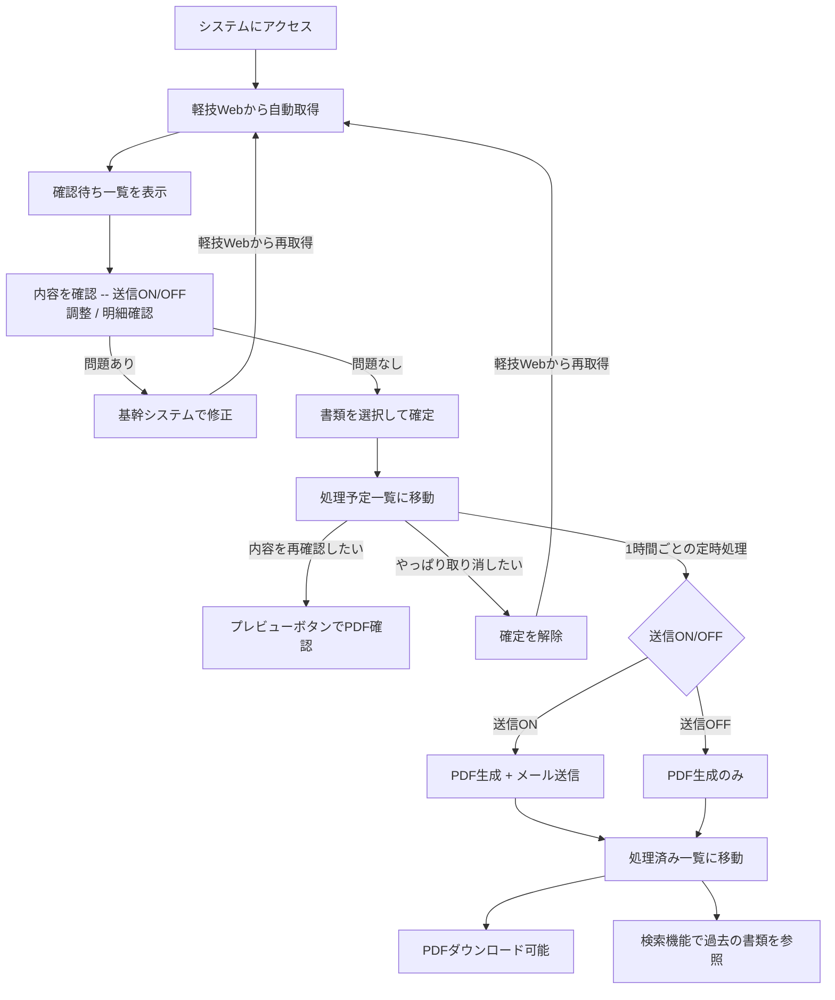

# 業務フロー図

## 全体フロー



## 日常の業務サイクル

```
┌─────────────────────────────────────────────────────┐
│ 営業担当者の作業（随時）                              │
│                                                     │
│  1. システムにアクセス（自動で最新データ表示）         │
│  2. 確認待ち一覧で内容を確認                         │
│  3. 送信ON/OFFを必要に応じて切り替え                 │
│  4. 問題なければ書類を選択して「確定」                │
│     → 処理予定に移動                                │
│  5. 必要に応じてプレビューで送信内容を確認            │
│                                                     │
├─────────────────────────────────────────────────────┤
│ システムの自動処理（1時間ごと）                       │
│                                                     │
│  6. 処理予定の書類を自動でPDF生成                     │
│  7. 送信ONの書類 → メールで得意先に送信              │
│     送信OFFの書類 → 送信せずに処理済みへ             │
│  8. エラー時のみ担当営業にメール通知                  │
│     → 処理済みに移動                                │
│                                                     │
├─────────────────────────────────────────────────────┤
│ 確認・検索（随時）                                    │
│                                                     │
│  9. 処理済み一覧で送信結果を確認                     │
│ 10. PDFダウンロードで控えを取得                      │
│ 11. 検索機能で過去の書類を参照（電帳法対応）          │
│                                                     │
└─────────────────────────────────────────────────────┘
```

## データの流れ

```
軽技Web ──取得──→ 確認待ち ──確定──→ 処理予定 ──定時処理──→ 処理済み
（BIツール）      （画面のみ）       （S3保存）              （S3保存）
                  DBに保存しない     ↕ 確定解除可能           PDFダウンロード可
                  毎回最新取得       ↕ プレビュー可能         検索可能（10年分）
```

## 確認ポイント

- [ ] この業務フローで日常の運用が回るか
- [ ] 確定のタイミング（誰が、いつ、どの頻度で）
- [ ] 確定解除が必要になるケースはどんな場合か
- [ ] 1時間ごとの自動送信で問題ないか
